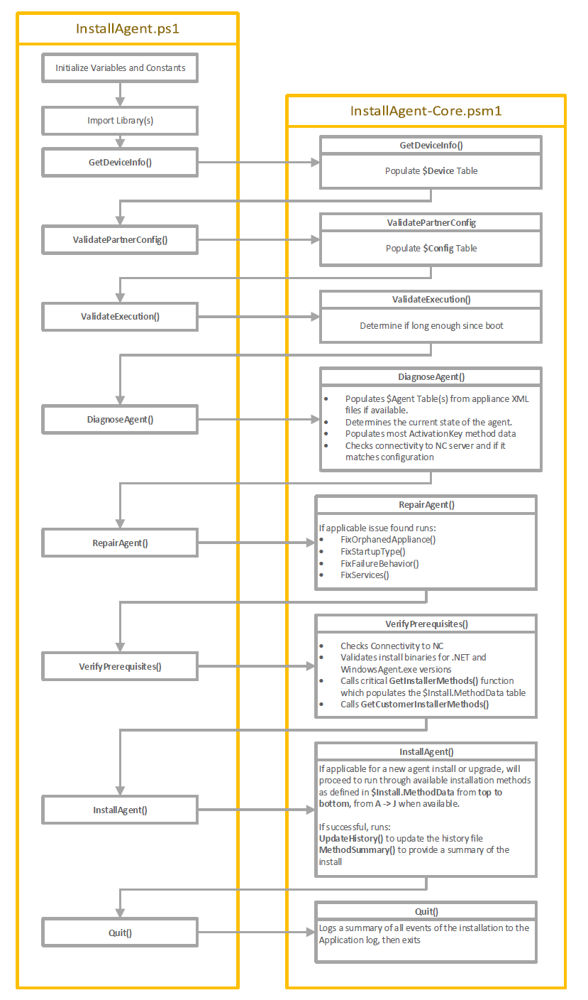

# Development and Debugging
## Overview
The PowerShell version of the InstallAgent package uses a highly structured, robust coding methodology with validation and logging at every step, these characteristics make it suitable for use in broad rollouts from small to enterprise businesses.

While it has many positive attributes it can be difficult to approach when re-developing or debugging. So let's provide a high level view of how the script would run under normal circumstances and highlighting the important parts:



While this doesn't represent all the functions inside of the InstallAgent-Core.psm1, we will explore it more in depth.

## Challenges and starting debugging
There are a number of challenges that you can run into when developing code for the InstallAgent package:
*   The Installagent.ps1 and the folder structure is intended to self delete after running, as it's intended to be run temporarily from C:\Windows\Temp\AGPO after the LaunchInstaller.bat/ps1 copies it there from the Netlogon/Source folder.
*   Functions in InstallAgent-Core.psm1 depend upon variables declared in InstallAgent.ps1 that exist in Script scope, this is opposed to functions that are passed passed parameters and all variables are private to it's scope
*   Functions will populate a number of variables with hashtables, their fields names and types are not declared anywhere in code.

The latter challanges are necessary artifacts caused by the constraints in PowerShell 2.0, to debug this code efficiently and cross reference variables it is necessary to use an IDE like Visual Studio Code or PowerShell ISE.

A point to set a debug point to see all the variables/tables populated and in a state to install or upgrade, I recommend put a breakpoint on the call to **SelectInstallMethod** function inside of the **InstallAgent** function at around line 3107 at time of writing.

Next either populate the PartnerConfig as outlined in the ReadMe.md and/or run the InstallAgent.ps1 with CustomerID/Token parameters, it's important to run the script with the dot source operator (period) and run it inside the [current session scope](https://devblogs.microsoft.com/powershell/powershell-constrained-language-mode-and-the-dot-source-operator/)

`. .\InstallAgent.ps1 -CustomerID CustomerID -RegistrationToken RegistrationToken -LauncherPath C:\Repos\Agent\ -DebugMode`

Also make sure the LauncherPath parameter has a trailing \ otherwise it will cause issues. Once done you can explore all the variables in memory, and run some of the built in debug commands that provide a Gridview of useful tables:
*   DebugGetMethods
*   DebugGetAppliance

Another function available is **DebugGetProxyTokens**, this is used to resolve all Customer IDs inside applicable install method data through the **RequestAzWebProxyToken** function.

# <span style="color: red;">TBC in next branch pull</span>

<span >

## Discuss important functions 
### GetInstallMethods function
The GetInstallMethods function is the key method through in which validated installation data from the different sources is checked one last time before it is populated into the $Install.MethodData Hashtable

The first important part of this function is here:

```powershell
$Values = @(
    $Script.ActivationKey,
    $Config.ActivationKey,        
    $Agent.History.ActivationKey,
    $Agent.Appliance.SiteID,
    ($Script.CustomerID),
    "$($Script.CustomerID)|$($Script.RegistrationToken)",
    "$($Agent.History.ScriptSiteID)|$($Agent.History.RegistrationToken)",
    "$($Config.CustomerId)|$($Config.RegistrationToken)",
    $Script.CustomerID,
    $Config.CustomerId
)
```
These values are then piped through the `for ($i = 0; $i -lt $Values.Count; $i++) { ... } ` loop where for each `$i` it generates a hashtable and assigns it through to the `$Install.MethodData` table.

Where this can be confusing is that the assignment is done here `$Install.MethodData.$(AlphaValue $i)` there the `AlphaValue $i` function is called on `$i` to resolve it to the letter, eg. $i==1 is the letter A, $i==2 is B but this is how we populate out $Install.MethodData.(A,B,C,D ... ) keys.

The hashtable assigned after that has a lot of logic in it, but results in the following hashtable being generated, in this case for the typical case of `$Install.Methodata.A`:
```
Name                           Value                                                                                                                                                          
----                           -----                                                                                                                                                          
Parameter                      AGENTACTIVATIONKEY                                                                                                                                             
FailedAttempts                 0                                                                                                                                                              
Type                           Activation Key: Token/AppId                                                                                                                                    
MaxAttempts                    1                                                                                                                                                              
Value                          c2hvcnRlbmVkIGZvciB0aGlzIGRvY3VtZW50                                          
Name                           Activation Key : Token (Current Script) / Appliance ID (Existing Installation)                                                                                 
Attempts                       0                                                                                                                                                              
Failed                         False                                                                                                                                                          
Available                      True                                                                                                                                                           
```
This is then iterated for each loop until all install methods for available sources is populated in A ->J to fill out the whole $Install.MethodData which if you view it with the DebugGetMethods


Let's dive into the next section of logic for the value of the `Available` key as it's is extremely specific and pulls from multiple pieces of data from different hashtables
```powershell
"Available"      =
if (
    ($Agent.Health.AgentStatus -eq $SC.ApplianceStatus.E) -and
    ($i -lt 5)
) {
    # Only use Script Customer ID for Takeover Installations
    $false
}
elseif (!$Config.IsAzNableAvailable -and $SC.InstallMethods.UsesAzProxy.(AlphaValue $i)) {
    # If AzNableProxy configuration isn't available and method uses it...
    $false
}
elseif ($Config.IsAzNableAvailable -and $SC.InstallMethods.Type.(AlphaValue $i) -eq $SC.InstallMethods.InstallTypes.B -and $Agent.Health.Installed -eq $false) {
    # If the type is AzNableProxy, it is Activation Type install and the agent is not installed
    $false
}
else { $null -ne $Values[$i] -and "|" -ne $Values[$i] -and $Values[$i] -notlike "*|" }
```
Let's break this down to each if/else statement:
```powershell
if (($Agent.Health.AgentStatus -eq $SC.ApplianceStatus.E) -and ($i -lt 5)) {$false}
```
If the `$Agent.Health.AgentStatus` which is a diangoed to be one of the following values in `$SC.ApplianceStatus` table in the `DiagnoseAgent` function called prior to the GetInstallMethods
```powershell
$SC.ApplianceStatus = @{
  "A" = "Optimal"
  "B" = "Marginal"
  "C" = "Orphaned"
  "D" = "Disabled"
  "E" = "Rogue / Competitor-Controlled"
  "F" = "Corrupt"
  "G" = "Missing"
}
```
Is then determined to be the key value for `E` which is "Rogue / Competitor-Controlled", and the `$i` value is less than 5 which is the cut off point between Activation Key methods and Registration key methods. If all this is true then we assign `$false` to the `Available` key.

Or in short if the agent is Rogue / Competitor-Controlled don't use Activation Key methods, always use Registration key methods; this is because the Activation Key method attempts to register with the N-Central server with a specific Appliance ID, if that Appliance ID is from a competitor N-Central server there would be a chance we'd register a device over the top of an existing device and cause a conflict.

**Next section**
```powershell
elseif (!$Config.IsAzNableAvailable -and $SC.InstallMethods.UsesAzProxy.(AlphaValue $i)) {
    # If AzNableProxy configuration isn't available and method uses it...
    $false
}
```
This checks if the `$Config.IsAzNableAvailable` variable is `$false` and that the `UsesAzProxy` value for that method, which is again looked up through `AlphaValue $i`
```powershell
  "UsesAzProxy"  = @{
    "A" = $false
    "B" = $false
    "C" = $false
    "D" = $true
    "E" = $true
    "F" = $false
    "G" = $false
    "H" = $false
    "I" = $true
    "J" = $true
  }
```

Or in short, if the information for the AzNableProxy is not in the PartnerConfig, and the current Method uses that service, then it sets `Available` as `$false`

**Next section**
```powershell
elseif ($Config.IsAzNableAvailable -and $SC.InstallMethods.Type.(AlphaValue $i) -eq $SC.InstallMethods.InstallTypes.B -and $Agent.Health.Installed -eq $false) {
    # If the type is AzNableProxy, it is Activation Type install and the agent is not installed
    $false
}
```

This should be more familiar to us now, if the AzNableProxy information is in the PartnerConfig, and the current InstallType value that is in the following hashtable
```powershell
"InstallTypes" = @{
"A" = "Activation Key: Token/AppId"
"B" = "Activation Key: AzNableProxy->Token/AppId"
"C" = "Registration Token: CustomerId/Token"
"D" = "Registration Token: CustomerId/AzNableProxy->Token"
}
  ```

Is found to be of type `B` or the "Activation Key: AzNableProxy->Token/AppId" type and the Agent is not installed; then we set `Available` as `$false`

Or in short, don't make the AzNableProxy type Activation Key install methods available if there is no agent to upgrade.

**Finally:**
```powershell
else { $null -ne $Values[$i] -and "|" -ne $Values[$i] -and $Values[$i] -notlike "*|" }
```
The first thing we should note here is this is an `else`, not an `elseif` so we're not evaluating this to determine *if* we run a code block, this *is* the code block we are running. This is fairly straight forward:
*   If the value is not null and;
*   the value is not a plain pipe, which is a value that we can get as it's a delimeter when constructing the `CustomerID|Token` string and;
*   the value is not a CustomerID, followed by a pipe, then no token, again an artifact of constructing the `CustomerID|Token` that is later used in the `InstallAgent` function for Registration Key methods

## DiagnoseAgent function
The DiagnoseAgent function is one of the larger and more complicated functions so we'll provide a high level overview of how this works:
*  It initialises the `$Agent.Appliance` which holds the current appliance health and the `$Agent.Docs` variables where de-serialized versions of the ApplianceConfig.xml, the Install Log and a copy of the Agent install registry keys are placed while they are parsed and the health of the Agent determined.
* As the files and registry are loaded into the `$Agent.Docs` they are validated against regex expressions found under the `$SC.Validation` variable declared in the InstallAgent.ps1 file. If any part of the agent documents fail the regex test, the script will halt later on and provide information on the failed document.
* The next section then builds the Activation Key/Appliance ID from available parts if they're available, by building the activation key we can perform ugprades on existing installs while specify the appliance ID, reducing the chance of generic installs resulting in a database mismatch.
* The agent history file is updated with the token data and the health of the agent services are checked
* The ApplianceID and version of the agent is checked, if the agent version is less than the target version then it is flagged for an update
* Connectivity to the Partner N-Central server is checked, if it isn't available only limited repairs can be done as a connection to the N-Central server is required for installs or upgrades.
* A summary of the Agent health is placed in a hash table inside teh $Agent.Health.AgentStatus variable
* The agent status is logged for the final event log output
* If the agent is healthy and there is nothing to be done, the script ends, otherwise it proceeds to the next phases of repair or re-install

## RequestAzWebProxyToken function
RequestAzWebProxyToken is new to 6.0.0 and leverages Kelvin Tegelaar's AzNableProxy to retrieve the registration token securely from your on N-Central server without exposing API keys.

To retrieve this token the function will:
* Create a URI from the partner configured values in the variables `$Config.AznableProxyUri` and `$Config.AzNableAuthCode`
* A PowerShell 3.0 Invoke-Webrequest method is called to retrieve the registration token. While technically the script is meant to be PowerShell 2.0 compatible there is a broader discussion on the security of PowerShell 2.0 and the age of the OS being used if it is 2.0. While it is possible to use a `[System.Net.WebClient]` method to download the registration token, that would be associated with TLS1.0 and you would need to make a concious security decision to use that legacy protocol.
* The retrieved token is checked to determine if it is a valid GUID
* If the chosen install method is of a type that requests converting to an encoded install key, it is created, otherwise the token is provided raw to the `$Install.ChosenMethod.Value`
## Custom Modules
The default InstallAgent-Core.psm1 module provides the default behaviors, and now includes AzNableProxy token lookup by default.

By using custom modules that override default functions you can achieve most any features you need for edge case deployments. This works because of the order in which the modules are loaded, for example the new `RequestAzWebProxyToken` has certain default behaviors that may not be suitable for your environment, by loading a custom module after the inital InstallAgent-Core.psm1 that has a function with the same name, the custom module you created will supercede the default `RequestAzWebProxyToken`

Once you've created your new module/files, place it in the Agent\Lib folder and update the $SC.Names.LibraryFiles array in the InstallAgent.ps1 file.

Examples of what can be achieved is illustrated with the following files within the Custom Library folder:

GetCustomInstallMethodExamples.psm1 - Demonstrates how you can provide a custom Install Method information back to the correct Hashtable
CustomOverrideExample.psm1 - Demonstrates how you can
Add additional telemetry when calling the AzNableProxy GET function with a few extra lines of code
Deliver detailed telemetry on Exit or Failure with a few extra lines of code
## Appendices: Detail on example tables of importance
### $Config
The `$Config` table is the variable to which the values of the **PartnerConfig.xml** is assigned, this is a 1:1 mapping of the Keys and Values.

|Key|Value|
| :- | :- |
|NCServerAddress|ncentral.mymsp.com|
|ServiceQueryString|Auto|
|AgentFile|WindowsAgentSetup.exe|
|NETFile|NET4\_5\_2-Universal.exe|
|AzNableAuthCode|c2hvcnRlbmVkIGZvciB0aGlzIGRvY3VtZW50 |
|ErrorContactInfo|My MSP information call 1800 123 456|
|AgentVersion|2020.1.5.425|
|PingTolerance|20|
|LocalFolder|C:\Windows\Security ThroughObscurity|
|ServiceStartup|Automatic|
|ServiceRepairString|Auto|
|ActivationKey|c2hvcnRlbmVkIGZvciB0aGlzIGRvY3VtZW50 |
|ServiceDelayA|0|
|NETVersion|4.5.2.0|
|NetworkFolder|Agent|
|ServiceDelayC|0|
|ServiceCommand||
|ServiceReset|86400|
|ServiceActionB|RESTART|
|CustomerId|364|
|InstallFolder|CurrentAgent|
|NETFileVersion|4.5.51209.34209|
|RegistrationToken|f01ebde4-9cd2-46a1-9e5b-a41961c9c43b|
|AgentFileVersion|2020.1.50425.0|
|AzNableProxyUri|myazproxy.azurewebsites.net|
|PingCount|20|
|ServiceDelayB|120000|
|BootTimeWaitPeriod|0|
|ProxyString||
|ServiceRequireDelay|FALSE|
|ServiceActionA|RESTART|
|IsAzNableAvailable|TRUE|
|InstallTimeoutPeriod|5|
|ServiceActionC|RESTART|

### $Script

The `$Script` hashtable is the root table for several other sub-hashtables such as the results, sequence and path, the more important vales here are `CustomerID` and `ActivationKey` that are passed through to the Method Data

|Name|Value|
| :- | :- |
|Sequence|{Status, Order}|
|Results|{LauncherSource, ScriptSource, ScriptEventKey, ScriptInstallKey...}|
|RegistrationToken|f01ebde4-9cd2-46a1-9e5b-a41961c9c43b|
|Execution|{ScriptLastRan, ScriptAction, ScriptMode, ScriptVersion...}|
|CustomerID|123|
|Path|{InstallDrop, Library, TempFolder, PartnerFile}|
|ActivationKey|c2hvcnRlbmVkIGZvciB0aGlzIGRvY3VtZW50|
|Parameters|{[CustomerID, 123], [RegistrationToken, {GUID}],[LauncherPath,C:\temp\], [DebugMode, True]}|
|Invocation|C:\temp\InstallAgent.ps1|

### $Device
The `$Device` stores the results of the `GetDeviceInfo` function, these values are retrieved early on to help identify the location of the agent, the .NET version and if that needs to updated prior to proceeding. It's at this stage we can also quit out if there is something about this version of Windows that is not compatible. As older OS's like Windows 8/8.1 and 2012 R2 are phased out the values can be used to exit before attempting install.

|Key|Example Values|
| :- | :- |
|PF|C:\Program Files|
|ServerCore|FALSE|
|Name|MY-REAL-PC|
|IsSRV|FALSE|
|OSBuild|10.0.18363|
|Architecture|64-bit|
|IsBDC|FALSE|
|LastBootTime|12/02/2021 14:42|
|FQDN|WORKGROUP|
|IsWKST|TRUE|
|IsDC|FALSE|
|NETProduct|4.8.0.0|
|Hostname|MY-REAL-PC|
|NETDisplayProduct|4.8.0.0|
|OSName|Microsoft Windows 10 Enterprise|
|PF32|C:\Program Files (x86)|
|NETVersion|4.8.4084.0|
|PSVersion|5.1.19041.610|
|Role|Standalone Workstation|
|IsDomainJoined|FALSE|

### $Install
The `$Install` has a number of sub-hashtables, noteable of which is the MethodData table covered previously that can be viewed with the `DebugGetMethods` function.

Other important values include the `ChosenMethod` hashtable, this table holds the 'current' MethodData table that is being processed in the `InstallAgent` function as it loops through the different methods; useful when debugging inside the `InstallAgent` function and you need to determine what method is currently being attempted.

$Install.RequiredAction is useful to interrogate to determine what the final action type was determined by the script prior to install being called.

Finally the `$Install.ChosenAgent.InstallPath` (below) along with the `$Install.AgentString` are called in the:

```$Proc = [System.Diagnostics.Process]::Start($INST)``` 

Line to actually run setup with the given parameters for that Install type.

|Name|Example Values|
| :- | :- |
|Results|{SelectedNETKit, SelectedAgentKit}|
|MethodResults|{E, D, J, F...}|
|ChosenNET|{Path, Version, FileName, InstallPath}|
|Sources|{ChosenNET, Demand, ChosenAgent, Network}|
|NETLOGONAccess|FALSE|
|ChosenAgent|{Path, Version, FileName, InstallPath}|
|MethodData|{E, D, G, F...}|
|RequiredAction|Upgrade Existing|
|NCServerAccess|TRUE|
|ChosenMethod|{Parameter, FailedAttempts, Type, Method...}|
|AgentString|/S /V" /qn AGENTACTIVATIONKEY=c2hvcnRlbmVkIGZvciB0aGlzIGRvY3VtZW50"|

#### $Agent.ChosenAgent.InstallPath
|Name|Example Values|
| :- | :- |
|Path|\\\mydomain.local\netlogon\Agent\CurrentAgent\WindowsAgentSetup.exe|
|Version|2020.1.50425.0|
|FileName|WindowsAgentSetup.exe|
|InstallPath|C:\Windows\Temp\AGPO\Fetch\WindowsAgentSetup.exe|

### $Agent
The `$Agent` table is provides an abundance of information about the Agent, it's current state or lack thereof, current processes etc.
* Appliance: Contains information merged from the ApplianceConfig.xml and ServerConfig.xml
* Path: Provides paths to configuration files and registry locations
* Processes: Provides information on running agent processes, needed when terminating them prior to upgrades etc.
* History: The values inside the History file, note that the History file is an XML output of the `$Agent.Appliance` when the agent is successfully installed/upgraded
* Services: Contains information on the Windows Services for the Agent/Maintenance
* Registry: Contains all the information from the registry uninstall key for the Agent
* DecodedActivationKey: Constructed during the Agent Diagnosis processes, what the Activation Key looks like prior to being encoded to base64.
* Docs: linked to the `[xml]` and registry key objects retrieved in the `DiagnoseAgent` function, these are the raw items before they are parsed, validated and populated into the above hashtables


|Name|Example Values|
| :- | :- |
|Appliance|{ID, WindowsVersion, Version, SiteID...}|
|Path|{Registry, ServerConfigBackup, Checker, ApplianceConfig...}|
|Processes|{Windows Agent Service, Windows Agent Maintenance Service}|
|History|{ID, WindowsVersion, SiteID, AssignedServer...}|
|HealthOptional|{}|
|Services|{Failure, Data}|
|Health|{ProcessesExist, AgentStatus, Installed, ApplianceIDValid...}|
|Registry|{UninstallString, InstallLocation, DisplayVersion, InstallDate}|
|DecodedActivationKey|HTTPS://nc.mymsp.com:443\|1234567890\|1\|f01ebde4-9cd2-46a1-9e5b-a41961c9c43b\|0\|
|Docs|{Checker.log, Registry, ApplianceConfig.xml, AgentHistory.xml...}|

#### $Agent.Appliance

|Key|Example Values|
| :- | :- |
|ID|1424021110|
|WindowsVersion|2020.1.1202.0|
|Version|2020.1.0.202|
|SiteID|364|
|AssignedServer|ncentral.mymsp.com|
|LastInstall|16/02/2021 22:20|
|ActivationKey|c2hvcnRlbmVkIGZvciB0aGlzIGRvY3VtZW50|

#### $Agent.Path

|Key|Example Values|
| :- | :- |
|Registry|HKLM:\Software\...\Uninstall\{3B3CE3D0-96E7-498F-8BFD-3D5511C07012}|
|ServerConfigBackup|C:\Program Files (x86)\N-Able Technologies\Windows Agent\config\ServerConfig.xml.backup|
|Checker|C:\Program Files (x86)\N-Able Technologies\Windows Agent\bin\Checker.log|
|ApplianceConfig|C:\Program Files (x86)\N-Able Technologies\Windows Agent\config\ApplianceConfig.xml|
|ApplianceConfigBackup|C:\Program Files (x86)\N-Able Technologies\Windows Agent\config\ApplianceConfig.xml.backup|
|ServerConfig|C:\Program Files (x86)\N-Able Technologies\Windows Agent\config\ServerConfig.xml|
|History|C:\Windows\SecurityObscurity\Agent\AgentHistory.xml|

#### $Agent.Health

|Key|Example Values|
| :- | :- |
|ProcessesExist|TRUE|
|AgentStatus|Disabled|
|Installed|TRUE|
|ApplianceIDValid|TRUE|
|ServicesRunning|FALSE|
|ServicesBehaviorCorrect|FALSE|
|ServicesExist|TRUE|
|AssignedToPartnerServer|TRUE|
|ProcessesRunning|FALSE|
|VersionCorrect|FALSE|
|ServicesStartupCorrect|FALSE|