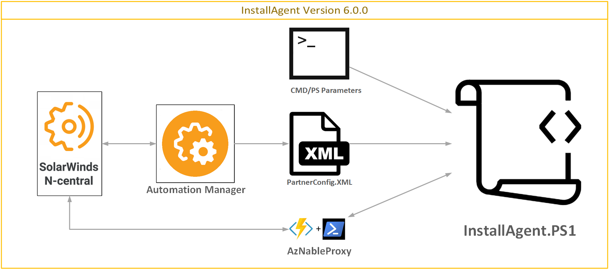
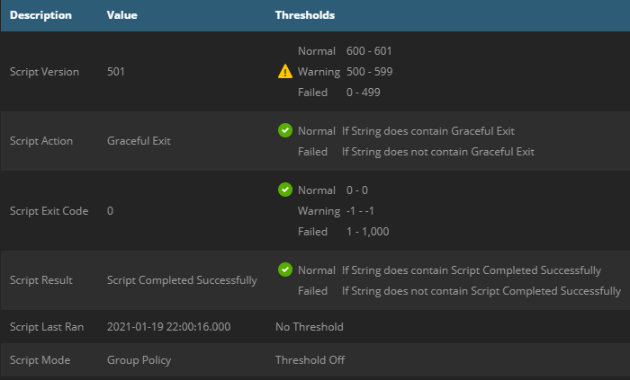
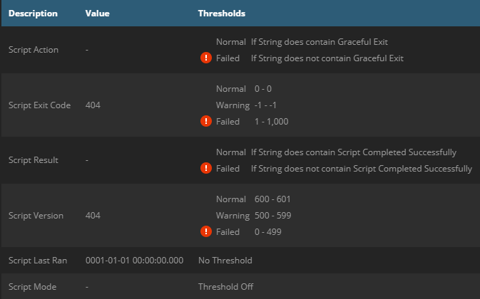
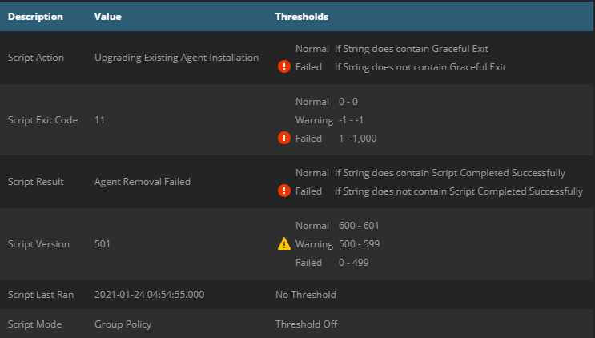

# InstallAgent Automation Suite

## Table of Contents
- [InstallAgent Automation Suite](#installagent-automation-suite)
  * [Introduction](#introduction)
  * [Status of Suite](#status-of-suite)
  * [Release notes for 6.0.2](#release-notes-for-602)
  * [Release notes for 6.0.1](#release-notes-for-601)
  * [New and improved Features in AgentDeploymentPackage 6.0.0](#new-and-improved-features-in-agentdeploymentpackage-600)
  * [Key Features](#key-features)
- [The "Registration Token" - Agent Deployment and Considerations](#the--registration-token----agent-deployment-and-considerations)
  * [History](#history)
  * [Overview](#overview)
  * [Automation of token deployment](#automation-of-token-deployment)
  * [Security](#security)
- [Components](#components)
  * [Deployment Package](#deployment-package)
  * [AMP-Based Custom Service Package](#amp-based-custom-service-package)
  * [Custom PowerShell modules](#custom-powershell-modules)
- [Registration Token and installation preference](#registration-token-and-installation-preference)
- [Preparation](#preparation)
  * [1 - Updating the Partner Configuration](#1---updating-the-partner-configuration)
  * [2 - Configure N-Central for Automatic Device Import](#2---configure-n-central-for-automatic-device-import)
  * [3 - Setup a Deployment Package](#3---setup-a-deployment-package)
- [Deployment](#deployment)
  * [1 - Choose a Deployment Method](#1---choose-a-deployment-method)
    + [On-Demand Deployment](#on-demand-deployment)
    + [Group Policy Deployment](#group-policy-deployment)
  * [OPTIONAL](#optional)
  * [1a - Setup the N-Central Custom Service (Version 6.xx)](#1a---setup-the-n-central-custom-service--version-6xx-)
  * [1b - Setup AMP based PartnerConfiguration update amps](#1b---setup-amp-based-partnerconfiguration-update-amps)
  * [1c - Setup AMP based PartnerConfiguration update amps](#1c---setup-amp-based-partnerconfiguration-update-amps)
  * [1d - Setup AMP based monitoring of the PartnerConfig.xml file](#1d---setup-amp-based-monitoring-of-the-partnerconfigxml-file)
    + [Update PartnerConfig from CP](#update-partnerconfig-from-cp)
    + [Update PartnerConfig from JWT](#update-partnerconfig-from-jwt)
  * [2 - Review Deployment Package Results](#2---review-deployment-package-results)
    + [Windows Event Log](#windows-event-log)
    + [Windows Registry](#windows-registry)
      - [InstallAgent Key](#installagent-key)
      - [Diagnosis Key](#diagnosis-key)
      - [Installation Key](#installation-key)
      - [Repair Key](#repair-key)
    + [N-Central Custom Service](#n-central-custom-service)
- [Testing and Troubleshooting](#testing-and-troubleshooting)
    + [Agent Setup Launcher Exit Codes](#agent-setup-launcher-exit-codes)
    + [Agent Setup Script Exit Codes](#agent-setup-script-exit-codes)
- [Excluding Devices](#excluding-devices)
- [Routine Updates](#routine-updates)
- [Credits](#credits)

## Introduction
This is a community-based Automation Suite intended as a replacement for the stock N-central Group Policy Installer Script as provided by N-able. It is not supported by N-able, so please do not contact their support department regarding any problems or questions about this script. In addition, please do not contact the support departments of any individual Partners in the Community regarding the Automation Suite or its components.

This suite is a fork of [Ryan Crowther Jr's AgentDeploymentPackage on GitHub](https://github.com/N-able/AgentDeploymentPackage/) and will soon be the future branch going forward as they have moved on to other projects.

If you discover a problem with any component of the Automation Suite or have ideas on how it could be improved, [post an issue on GitHub](https://github.com/AngryProgrammerInside/InstallAgent/issues). Alternatively, post on the N-Central Slack Community chat.

These tools are provided as-is, in the best of faith, by those Partners and Community Members involved in their development. If you use this in your environment, we would love to hear from you on GitHub!

## Status of Suite
All scripts in the suite have been run and tested as functional. It is currently considered in a 'beta' phase while wider testing is being performed.

Feel free to provide feedback and lodge issues and they will be reviewed.

## Release notes for 6.0.2
* Fixed several small bugs, full [Release Notes](ReleaseNotes.md)
* Added WSDL endpoint based N-Central Server verification for environments where Echo/ICMP is blocked, or where additional verification that the server N-Central is up and accessible. Enabled by setting the `<UseWSDLVerification>` attribute to **True**
* Added forced removal/cleanup when bad MSI uninstall information or MSI unable to remove old/rogue agent when needed using the AgentCleanup4.exe. Enabled by setting the `<ForceAgentCleanup>` attribute to **True**

## Release notes for 6.0.1
* Fixed a large number of bugs, full [Release Notes](ReleaseNotes.md)
* Added the ability enable/disable service policy enforcement with `<EnforcePolicy>` attribute for service timeouts/restarts. By default is now **False** as the service policy can get overriden by the maintenance service eventually.

## New and improved Features in AgentDeploymentPackage 6.0.0


*   Registration token install method:
    *   Activation Key methods for upgrades
    *   Registration Key methods for new installs/repairs
*   Sources for the registration token can include:
    *   Script input parameters
    *   A configuration file located in the root of the script folder
    *   Kelvin Tegelaar's AzNableProxy via an Azure Cloud function also on GitHub under [KelvinTegelaar/AzNableProxy](https://github.com/KelvinTegelaar/AzNableProxy)
    *   Last successful install configuration saved to a local file
*   Functioning N-Central AMP scripts that support 2 methods for updating the configuration file used for installation
    *   Direct update of Customer ID/Registration Token and other values from N-Central Custom Property (CP) injected via N-Central API See: [How to N-Central API Automation](https://github.com/AngryProgrammerInside/NC-API-Documentation) for examples
    *   Automatic update of Customer ID/Registration token from values pulled from local Agent/Maintenance XML along with provided JWT (see above documentation)
*   Functioning N-Central AMP script to update/renew expired/expiring tokens
*   Legacy Support: If you still have old values within your GPO, you can use a flag within the LaunchInstaller.bat to ignore provided parameters and rely upon the configuration file
*   Custom installation method data
    *   Through additional modules you can use your own source for CustomerID/Registration Token enumeration
    *   A sample module is provided
*   Added a new LaunchInstaller.ps1 while still providing LaunchInstaller.bat, either can be used but those wanting to move away from batch files can.
*   Optional upload of installation telemetry to Azure Cloud, giving insight into success/failure to help track checkins against N-Central
    *   Example modules provided
*   Quality of Life for development and debugging:
    *   Added debugmode to the InstallAgent.ps1 to avoid self destruct and reload of modules
    *   Added debug function to provide Gridviews of common tables
    *   For more details on development debugging of this script, check out this page on GitHub

## Key Features

The **InstallAgent Automation Suite** provides the following key features for deployment and facilitation of the N-Central Agent:

*   Automatic Installation of up to 2 distinct versions of the N-Central Agent
*   Automatic Installation of prerequisite software required by the **Agent Setup Script** and the N-Central Agent which, at time of publication, includes:
    *   N-Central Agent Requirements
        *   .NET Framework 4.5.2 for Current Agents (11.0.1.xxxx and Above)
    *   Script Requirements
        *   PowerShell 2.0 for Windows 7 / Server 2008 R2 and up

*   Boot-Time or On-Demand Detection and Automatic Repair of degraded or non-functional Agents with the following symptoms:
    *   Stopped Agent Service(s)/Process(es)
    *   Missing Agent Service(s)/Process(es)
    *   Incorrect Agent Service(s) Startup Type (Partner Configurable)
    *   Incorrect Agent Service Failure Behavior (Partner Configurable)
    *   Missing Agent Installation
    *   Invalid Appliance ID in Local Agent Configuration (causes Agent check-in to fail)
    *   Invalid N-Central Server in Local Agent Configuration (causes Agent check-in to fail)
    *   Rogue or Competitor Agent (reclaims Agents that may be authenticating with another N-Central Server)
    *   Outdated Agent Installations (Partner Configurable)

*   Verbose single-entry Event Log Output each run - Get a full report of any findings and actions without cluttering your Event Log

*   Live Script Status Updates and Timestamps for last actions the Script has taken via Registry

# The "Registration Token" - Agent Deployment and Considerations

## History
An information disclosure vulnerability was found in the N-Central platform in certain circumstances, this lead to auto-import being disabled in 12.1 SP1 HF2. As a part of mitigating this vulnerability N-Able introduced registration tokens in 2020.1 to allow automatic import of devices. The patch notes regarding the tokens was as follows:

>In order to enhance the security of the agent registration process, and to turn back on the ability to fully autoimport any discovered device, N-central now requires that a new Registration Token be provided during any
agent install.
>
> We've taken care to make this new security requirement as easy as possible for your technicians – the customerspecific installers now come pre-bundled with a registration token, and you can also specify the token as a
command line parameter for Group Policy or scripted deployments of the agent.
>
> From an administrative point of view, you're also going to find this to be a breeze – tokens are automatically
regenerated by N-central, and you can control how long the tokens last for via the **Administration > Defaults >
Agent/Probe Settings** page, on the new **Registration Tokens** tab – that's also where you can revoke tokens,
should the need arise.
>
>Please note that because of the new registration token feature, older versions of the agent installer will no
longer be able to register themselves with N-central.
Because these changes are in-place, we've also fully re-enabled automatic importation of devices. You're
welcome!


## Overview
The registration token is a simple random GUID that in combination with the customer Id acts as a password for installation.  With 2^122 possible tokens values there is no practical method for brute forcing, ensuring that only those with tokens generated for a customer/site can install an agent.

From a practical standpoint getting the token from your N-Central server to an endpoint poses several challenges

*   By default tokens will expire after a period of time
*   ***At time of writing*** tokens are *only* generated by human interaction with the N-Central UI with one of:
    * Under **Actions -> Download Agent/Probe** and click on either **Get Registration Token** or download a Customer/Site Specific Agent/Probe that has the token pre-baked in.
    *   Click on an device that supports agent installation, then go to **Settings -> Local Agent** and click **Get Activation Key**

I note at time of writing as there is a planned feature to allow it to be refreshed via the N-Central API, otherwise when you first upgrade to a 202x.x platform you will need to manually generate them.

These challenges make automation of registration key deployment difficult, with many MSPs simply disabling the token expiration, and some engineers spending their mornings clicking on the same button repeatedly and pasting tokens out to a spreadsheet to then manually update in GPOs.

The other challenge is how to deal with deploying at scale to the following kinds of environments:
*   Customers with multiple sites but the same domain
*   Multiple customers/sites on a multi-tenanted domains

## Automation of token deployment
To tackle the challenges of Agent deployment the community has produced several solutions that involve the N-Central API in some way. To utilise the N-Central API requires what is know as JSON Web Token (**JWT**). A JWT effectively allows anyone with that token to be able to access your N-Central server with all of the permissions associated with the user account it was generated from, so security consideration needs to be taken in where it is stored and how it is used.

Here are some of the main methods of token retrieval that have been developed by the N-Able community:
*   Direct passing of Customer, Token and JWT held in a GPO through to a script that pulls the token from N-Central API then installs
*   Passing the Customer ID to an Agent install script that uses an authenticated Azure function with the JWT hidden in the Configuration
*   Retrieving the token values from the N-Central API then re-injecting them to Custom Properties (CPs), then then injecting those values into installation configuration files.

The updates to the InstallAgent are intended to take advantage of the PartnerConfig configuration file by containing the Customer ID and registration token needed for new or upgrade installations, as well as configuration of the URI and AuthCode needed for an Azure based proxy token if desired.

To update the PartnerConfig file with these values two AMPs have been provided to routinely update the configuration file as needed:
*   **Refresh Agent from JWT-API** - This method uses local enumeration of the agent it is run on to gather the Customer ID and Configuration needed, along with a JWT passed to the running agent.

*   **Refresh Agent Token from CP** - This method uses some local enumeration for the N-Central server address, but otherwise it is intended to pass through the Customer ID and token from Custom Properties of the Customer/Site

*   **RequestAzWebProxyToken() function** - Built into the script is a function that takes the Uri and Authcode and pulls the relevant registration token. The AzNableProxy is simple to deploy to your own company Azure subscription, with a few clicks and a coffee break this token retrieval method can be adapted to many scenarios with just a CustomerID provided.

## Security
Security is at the forefront of everyone's mind when looking at automated deployment, MSPs are continually targetted by bad faith actors, given this some further detail on security of tokens and JWT will be explored for each method here:

*   **Refresh Agent from JWT-API** - This method passes the JWT through the local agent securely over HTTPS before being passed into the AMP parameters. The JWT is never written to the disk but is resident in the Agent process and AMP for several seconds. An attacker would need a compromised device, which for GPO deployments is a Domain Controller, with escalated priveleges to have a chance at obtaining the JWT for the few random seconds it is in memory; given this the method is considered to have very low risk of exposure.

*   **Refresh Agent Token from CP** - In this method you would likely populate Custom Properties with a custom script from a device that is located inside the perimeter network that is secured with 2FA. Treat the JWT as you would any username/password with the principal of least privelage.

*   **RequestAzWebProxyToken() function** - This method's JWT is secured inside of a function configuration file `local.settings.json` in an Azure subscription, accessed by accounts that should be secured by 2FA. Microsoft's Azure functions are secure by design, and their security meets many international standards. If you have compliance requirements, store the token in a [Key Vault](https://docs.microsoft.com/en-us/azure/app-service/app-service-key-vault-references).

Another component of the automation suite to consider in terms of security is the Refresh Agent Token.amp automation. This AMP directly takes a username and password of an account where MFA must be disabled, as well as a JWT of an account that can retrieve tokens. While these will be passed as variables and should only exist in memory while it executes, it is recommended to only run this automation item on a trusted device inside your perimeter network.

# Components

The **InstallAgent Automation Suite** is comprised of several Components to aid in the deployment and facilitation of the N-Central Agent, which are listed below:

## Deployment Package

The **Deployment Package** is suitable by itself for all deployments, and contains the following items:

*   **AGENT** Folder
    *   **CurrentAgent** Folder
        *   <sup>1</sup>**NET4_5_2-Universal.exe** - .NET Framework Installer required by Current Agents (11.0.1.xxxx and Above)
    *   **Lib** Folder
        *   **InstallAgent-Core.psm1** - Core Functions file for the **Agent Setup Script** (InstallAgent.ps1) which contains most of its key operations
    *   **InstallAgent.ps1** - **Agent Setup Script,** the main/wrapper script, which contains most pre-defined constants and structures for execution
    *   **LaunchInstaller.bat** - **Agent Setup Launcher,** the launcher script, which is called On-Demand (click-to-run) or by Group Policy (calling the Launcher by either method **requires an N-Central Customer/Site ID number as a Parameter for any new Agent installations**)
    *   **PartnerConfig.xml** - **Partner Configuration,** which is used to dictate most variable options to the **Agent Setup Script**
*   **AMPs** folder
    *   **Refresh Agent Token.amp** - AMP wrapper for below token refresh/update PS1 file
    *   **Refresh Agent Token.ps1** - Core code for refreshing/updating tokens inside of N-Central without human interaction
    *   **Update PartnerConfig from JWT-API.amp** - **AMP wrapper**, for below ps1 file that uses local agent information and a JWT token to automatically populate a PartnerConfig.xml
    *   **Update PartnerConfig from JWT-API.ps1** - **PS Code** for populating PartnerConfig
    *   **Update PartnerConfig from CP.amp** - **AMP wrapper**, for below ps1 file that populates the PartnerConfig from your N-Central Customer Property
    *   **Update PartnerConfig from CP.ps1** - **PS Code** for populating PartnerConfig from a Custom Organization Property
*   **Custom Library** folder
    *   **CustomOverrideExample.psm1** - Example function overrides for extended Azure telemetry capability
    *   **GetCustomInstallMethodExamples.psm1** - Example function to override or change your install method data. This function is called by default at the approriate time just prior to validation checks
    *   **LibReadme.md** - Brief instruction on usage of above files


<sup>1</sup> Download Instructions for these items are included at the designated location in order to reduce overall package size, as they are already freely available on the web

## AMP-Based Custom Service Package

The **Custom Service Package** is an optional download available with the **Deployment Package,** which integrates with N-Central to collect and monitor information about the most recent run of the **Deployment Package.**

The **Custom Service Package** contains the following items:

*   **Custom Service Package** Folder - Not required for any other Packages
    *   **Agent Installer v6.amp** - Automation Policy run by the Custom Service
    *   **Custom Service.ps1** - Core logic of the above AMP file
    *   **Agent Installer.xml** - The custom service file that you can import into N-Central


## Custom PowerShell modules
The default InstallAgent-Core.psm1 module provides the default behaviors, and now includes AzNableProxy token lookup by default.

By using custom modules that override default funtions you can achieve most any features you need for edge case deployments.

Add your custom modules to the **Agent\Lib** folder and update the $SC.Names.LibraryFiles array.

Examples of what can be achieved is illustrated with the following files within the Custom Library folder:
*   **GetCustomInstallMethodExamples.psm1** - Demonstrates how you can provide a custom Install Method information back to the correct Hashtable
*   **CustomOverrideExample.psm1** - Demonstrates how you can
    *   Add additional telemetry when calling the AzNableProxy GET function with a few extra lines of code
    *   Deliver detailed telemetry on Exit or Failure with a few extra lines of code

# Registration Token and installation preference
Prior to the advent of the registration token you simply supplied the Customer ID and domain to the script parameters in the GPO and everything else would work.

After the introduction of the requirements of the registration token, the challenge has become *how* to get the registration token to the device for both activation key and registration key type installation.

The methods that have been implemented by the community include:
*   Custom Script that takes the Customer ID and Token but requiring update of the token at the needed refresh date
*   Variations on token lookup via N-Central API with a JWT such as [DeployTheNCAgent GitHub community script by Chris Reid](https://github.com/N-able/ScriptsAndAutomationPolicies/blob/master/DeployTheNCAgent/DeployTheNCAgent.ps1) 
*   Token lookup by the more secure [AzNableProxy method by Kelvin Tegelaar](https://github.com/KelvinTegelaar/AzNableProxy) that hides the JWT
*   Update of the Customer ID/Token in PartnerConfig via N-Central AMP

The updates to the deployment package uses all the above methods in some manner to a achieve high a rate of installation success. Here is the list of installation methods available by default for upgrading or installing new agents in order:

1. Activation Key : Token (Partner Config) / Appliance ID (Existing Installation)
2. Activation Key : Token (Current Script) / Appliance ID (Existing Installation)
3. Activation Key : Token / Appliance ID (Historical Installation)
4. Activation Key : AzNableProxy Token / Customer ID, Appliance ID (Existing Installation)
5. Activation Key : Customer ID (Current Script) / AzNableProxy Token / Appliance ID (Existing Installation)
6. Site ID/Registration Token (Current Script)
7. Customer ID / Registration Token (Partner Config)
8. Customer ID / AzNableProxy Token (Partner Config)
9. Customer ID / AzNableProxy Token (Current Script)

If data from a source is not available the script will not attempt to install with that method data. In general the preference is PartnerConfig -> Script Parameters -> AzNableProxy. Let's go through some examples:

Scenario 1: You deploy the package to your Netlogon directory, and disable the flag in the LaunchInstaller.bat to read in script parameters. AzNableProxy elements are not in the PartnerConfig.
*   Upgrade path: It will attempt method 1 first, then fall back to 3. Failing that it will attempt method 7.
*   New install: It will attempt method 7 with the provided CustomerID/Token, no fallback.

Scenario 2: The package is deployed, same scenario as above but you have AzNableProxy deployed and the XML elements in the PartnerConfig updated.
*   Upgrade path: It will attempt method 1, 3, 4, 5 then 7, 8
*   New Install: It will attempt method  7 and 8.

Scenario 3: The package is deployed as above. LaunchInstaller is set to read parameters. Customer ID and Registration token is provided as parameters
*   Upgrade Path: 1 -> 9
*   New Install: 6 -> 9

# Preparation

## 1 - Updating the Partner Configuration

**The developers recommend editing the Partner Configuration (PartnerConfig.xml) with Visual Studio Code, however feel free to use your favorite text editor that supports "UTF-8 w/ BOM" Encoding.**

Open **PartnerConfig.xml** to begin. This **Partner Configuration** is your one-stop shop for configuring the **Deployment Package.** Enter data for each value between the relevant XML Tags (many values are already assigned Defaults to serve as an example). Information about the Expected Format and Purpose of each Configuration Value is contained above each value itself. Consider the table below a desk reference.

In normal circumstances you would configure values like Service Behavior and Script Behavior, then the rest will be updated/injected via the provided AMPs.

| Category | Value Name | Default Value | Mandatory | Purpose |
| -------- | ---------- | ------------- | --------- | ------- |
| **Branding** | *ErrorContactInfo* | | No | This is a space for your business contact info (Company Name, Address, Support Phone Number, etc.). This will be printed at the bottom of the Event Log entry when a documented error occurs. If using multiple lines, start your information at the **beginning of each line** (no indent) in the tag space. |
| **ScriptBehavior** | *BootTimeWaitPeriod* | 5 | No | If the system has booted recently, this is the amount of time (in minutes) to wait before Diagnosing an existing Agent (to avoid unnecessary Repair or Install due to the system still starting up) |
| | *InstallTimeoutPeriod* | 5 | Yes | If another program installation is already in progress on the system, this is the amount of time (in minutes) to wait for the Windows Installer Service to become available. If the Service is still busy when the *InstallTimeoutPeriod* expires, the **Agent Setup Script will terminate for this reason.** |
| **ServiceBehavior** | *ActionA* | RESTART | No | Windows Service Failure Actions for the Agent Services - What Windows will do when the Service fails |
| | *ActionB* | RESTART | No | You must specify actions consecutively, for example, if *ActionC* is specified, then neither *ActionA* nor *ActionB* can be empty. |
| | *ActionC* | RESTART | No | |
| | *DelayA* | 120 | No | Windows Service Failure Delays (in seconds) for the Agent Services - How long Windows will wait before taking each Action - Between 0 and 3600 seconds |
| | *DelayB* | 120 | No | You must specify delays consecutively, for example, if *DelayC* is specified, then neither *DelayA* nor *DelayB* can be empty. |
| | *DelayC* | 120 | No | Each Action should have a corresponding Delay, but if an Action is left blank, **the corresponding Delay value will be ignored.** |
| | *Command* |  | No | Command to execute for each **RUN** Action specified. **Use the absolute path to the Command to ensure your Command will run when and how you expect.** |
| | *Reset* | 1440 | No | Windows Service Failure Reset Period (in minutes) for the Agent Services - How long until Windows re-attempts the Failure Actions |
| | *Startup* | Auto | Yes | Desired Startup Type for the Agent Services |
| **Server** | *NCServerAddress* | | Yes | Your N-Central Server Address, which can be found in the **Server Address** box on the **Administration > Defaults > Appliance Settings > Communication Settings** page. **Do not copy and paste a Web Address.** For example, if you login to **https://n-central.mymsp.com/MyServiceOrganization/**, the Server Address may be **n-central.mymsp.com** instead. **You will always get the correct value from N-Central itself.** |
| | *PingTolerance* | 20 | Yes | Percentage value of dropped packets allowed when testing connectivity to the *NCServerAddress* specified |
| | *PingCount* | 20 | Yes | The number of pings performed when testing connectivity to the *NCServerAddress* specified |
| | *ProxyString* | | No | Proxy String if the Agent requires one to reach the *NCServerAddress* specified - see the **Partner Configuration** file for Acceptable Formats |
| **Deployment** | *LocalFolder* | C:\AGENT | Yes | This is the path of a Folder left behind on the system for retaining Local Activation Info for the Agent from previous runs of the **Deployment Package.** It contains no more information than is already in the Agent installation folder, but is there **in case the Agent is removed by a user, technician or N-Central Update and not installed again afterward.** |
| | *NetworkFolder* | AGENT | Yes | Name of the Root Folder that contains the **Deployment Package.** In Domain Group Policy Deployments, this must be placed in the NETLOGON Folder. **NOTE - Partners CURRENTLY using Versions of the InstallAgent Deployment Package PRIOR to 5.0.0 should NOT change this value from its Default (AGENT) unless they wish to update all existing GPOs with the new location** |
| **Deployment (Typical)** | *InstallFolder* | CurrentAgent | Yes | Name of the Folder used by the Package to hold relevant Installers for Current Agents (11.0.1.xxxx and Above) |
| | *NETFileName* | NET4_5_2-Universal.exe | Yes | Name of the .NET Framework Installer supplied in the Typical *InstallFolder* - change this only you elect to use a different package (i.e. .NET 4.6 for Vista/2008) |
| | *NETVersion* | 4.5.2 | Yes | User-Friendly Version of .NET Framework to install on Typical systems - for verification/logging purposes |
| | *NETFileVersion* | 4.5.51209.34209 | Yes | Windows Version of the .NET Framework Installer to use on Typical systems, which should match the **File Version** property when you right-click **Properties > Details.** |
| | *SOAgentFileName* | WindowsAgentSetup.exe | Yes | Name of the Agent Installer supplied in the Typical *InstallFolder* - change this each time you upgrade your N-Central Server, and **be sure to use the System-Level Agent Installer** |
| | *SOAgentVersion* | 2020.1.5.425 | Yes | User-Friendly (N-Central) Version of the Agent to install on Typical systems - for verification/logging purposes |
| | *SOAgentFileVersion* | 2020.1.50425.0 | Yes | Windows Version of the Agent Installer to use on Typical systems, which should match the **File Version** property when you right-click **Properties > Details.** |
| | *CustomerId* | null | No | The Customer ID value as found under **Administration > Customers**, typically populated via a provided AMP|
| | *RegistrationToken* | null | No | The Registration Token value as found under **Actions > Download Agent/Probe > Get Registration Token**, typically populated via a provided AMP|
| | *AzNableProxyUri* | null | No | The URI of the AzNableProxy function as found under the function app overview but without the leading https:// , ie. mytokenproxy.azurewebsite.net. Typically updated via a provided AMP.|
| | *AzNableAuthCode* | null | No | The AuthCode of the AzNableProxy function as found under the **Functions > GET function > Function Keys**. Typically updated via a provided AMP.|

Once you've made your adjustments, in most cases, you should be able to utilize the Configuration Values for your all your clients, but you may elect to customize them for specific environments. For example, you may wish to increase the *PingTolerance* for a Customer/Site where you know there is significant latency, and therefore Agents may have trouble reliably communicating with the N-Central Server.

A small amount of customization can also be made in the **Agent Launcher Script** (LaunchInstaller.bat):

| Value Name | Default Value | Mandatory | Purpose |
| ---------- | ------------- | --------- | ------- |
| *TempFolder* | C:\Windows\Temp\AGPO | Yes | This should be a Local Folder on the system where the **Deployment Package** components work from, **NOT to be confused with the *LocalFolder* value in the Partner Configuration.** Whether run by Group Policy or On-Demand (click-to-run), the required components are dropped here during execution and then **removed upon termination of the Package.** |
| *NoArgs* | 0 | Yes | Disable the usage of arguments passed to this script. This way you can **not** pass CustomerID and Token through arguments, but if you have an older GPO that still uses a domainname or the term AUTO, you can set this value to 1. This way you don't need to change all those GPO's. **If set to 1, you do need another way to pass CustomerID and Token, or through the PartnerConfig.xml, or through azNableProxy** |

If you elect to make any changes, you will need to adjust the values **immediately following the equals (=) sign** in their relevant **SET** statements. For example:

SET DLThreshold=**3**

becomes

SET DLThreshold=**5**

You may make a similar change to the one above in environments where network latency or reliable Internet connectivity is an issue.

## 2 - Configure N-Central for Automatic Device Import

In N-Central, Devices are **not automatically imported into the All Devices View by default.** To better facilitate the **InstallAgent Deployment Package** (especially GPO Deployments), enable Auto-Import of Windows Devices for the Customers/Sites you have deployed to by doing the following:

1 -  In N-central, open the Service Organization, Customer, or Site Level (whichever is most appropriate for where you will use the **Deployment Package**)

2 -  Open **Administration > Discovery Defaults** from the sidebar

3 -  Ensure that the **Workstations – Windows, Laptops – Windows** and **Servers – Windows** Device Classes have been added to the Selected box in the Auto-Import section (see below)


4 -  Click **Save**

## 3 - Setup a Deployment Package

1 -  In N-Central, from any Level, open **Actions > Download Agent/Probe Software** from the sidebar

2 -  Download your Agent Installer from the **System Software** section at the very bottom of the page. **Do NOT use a Customer or Site-specific Agent with the Deployment Package, or Installation actions may fail, resulting in missing Agents.**

3 -  Verify the following values for the System-Level Agent Installer you downloaded are correct in the Partner Configuration:

*   *(Typical)SOAgentFileName*
*   *(Typical)SOAgentVersion*
*   *(Typical)SOAgentFileVersion*

4 -  Add the System-Level Agent Installer to the ***NetworkFolder\\(Typical)InstallFolder*** location

The **Deployment Package** is now ready for On-Demand or Group Policy deployments!

# Deployment

You may utilize a single instance of the **InstallAgent Deployment Package,** such as the one you created in Step 3, for both Group Policy and On-Demand (click-to-run) deployment scenarios. **Please test the Deployment Package in your own controlled environment before starting a wide-scale deployment. Every environment is different!**

## 1 - Choose a Deployment Method

### On-Demand Deployment

This method is suitable for one-off Devices, or those that do not belong to a Windows Domain. The most common scenario for On-Demand Deployment is likely **installing on a single system that is completely new to the N-Central Agent.**

1 -  Grant access to the **Deployment Package** on the system (attach a removable USB drive, download or transfer the Package, etc.)

2 -  With a Local Administrator account, open a Command Prompt and run **LaunchInstaller.bat** with the desired Customer/Site ID as the **only Parameter**

Example - **DO NOT USE**

**F:\DeploymentStuff\AGENT\LaunchInstaller.bat 170 90d3f270-c8ac-48dc-9466-0d48f2ffc339**

Another use case for On-Demand Deployment may be running the **Deployment Package** for **Repair or Re-Installation purposes.**

1 -  Grant access to the **Deployment Package** on the system (attach a removable USB drive, download or transfer the Package, etc.)

2 -  With a Local Administrator account, simply double-click **LaunchInstaller.bat.** A Customer/Site ID Parameter will typically not be needed **UNLESS:**

*   There is no Agent on the system **AND**
*   There is no Local Activation Info from previous runs of the **Deployment Package**

If you're looking at targeting multiple systems with the **Deployment Package,** the most common solution is to set it up as a Group Policy Startup Script (see the **Group Policy Deployment** section below).

### Group Policy Deployment

This is by far, the preferred method for enterprise, or Windows Domain-managed environments of any size. This will allow the **Deployment Package** to run from the network on **any Domain system that has contact with a Domain Controller at boot.**

1 -  On a Domain Controller (preferably the Baseline Domain Controller), open the NETLOGON Folder (typically **\\\clientdomain.name\NETLOGON**) and place the entire **Deployment Package** (*NetworkFolder*) here

**NOTE - Partners CURRENTLY using Versions of the InstallAgent Deployment Package PRIOR to 5.0.0**
*   Simply replace the **AGENT** Folder in its entirety with the *NetworkFolder* you've defined in the **Partner Configuration**
*   You will NOT need to revise your existing GPO Parameters at all in the following steps, **UNLESS you have elected to change the *NetworkFolder* from its Default Value (AGENT)**.

2 -  In the **Group Policy Management Console,** create a new **Group Policy Object** and link to a suitable OU or to the Domain itself. You might name it **InstallAgent Deployment Package,** **Agent Deployment** or similar.

3 -  Select the new Group Policy Object node in the left-hand pane, then under the **Scope** tab and **Security Filtering** section, make sure **Authenticated Users** and **Domain Computers** are listed. If you would prefer not to deploy to **every Device in the Domain,** either exclude specific Computers from the GPO (remove Read Permissions) or use a separate OU from **Domain Computers.**

4 -  **Right-click and Edit** the new GPO node, then expand the following nodes in the left-hand pane: **Computer Configuration > Policies > Windows Settings > Scripts.** Open the **Startup** item on the right.

5 -  Click the **Add** button, and for the Script Name box, **Browse** to **\\\clientdomain.name\NETLOGON\**NetworkFolder*** and select **LaunchInstaller.bat.**

6 -  In N-Central, locate the Customer/Site ID for the client's Domain by reviewing either the **Administration > Customers** page at the Service Organization Level, or the **Administration > Sites** page at the Customer Level. Consider your environment before selecting the ID. In most scenarios, **you will probably want the Customer-Level ID,** since most Customers have a single Domain, or you may simply not use the Site Level in your N-Central setup. If, however, you have a **Domain or OU that is specific to only one Site,** you may opt to use that specific Site ID to have new Devices import there directly, instead of at the Customer Level.

7a - For existing deployments of Time Wiser's VBS based InstallAgent you will have typically have the domain or 'auto' variable in the. In the 5.0.1 version of the DeploymentPackage you may only have the Customer ID

Rather than edit the GPO in every single GPO deployment you have you can simply edit the NoArgs variable line in the LaunchInstaller.bat
```bat
REM - Don't use the arguments. This way, CustomerID and Registration Token aren't taken from the arguments. This to support older GPO's, that had CustomerID and Domainname as arguments
SET NoArgs=0
```
Change this flag to a value *other* than 0 and it will ignore all script parameters. Once you have your N-Central AMP in place to update the Customer ID/Registration token values.

7b -  In the **Script Parameters** box, depending on how you intend to provide the registration token information to the device:
*   Enter NO script parameters: The device will then retrieve details from the PartnerConfig or failback to the AzNableProxy depending on the context.
*   Enter the Customer ID only: The device will use the Customer ID preferentially during certain install types
*   Enter the Customer ID and Registration Token: The device will use the Customer ID and Registration token in highest preference when performing a new install


Congratulations! Your **Group Policy Deployment** is ready for action!


## OPTIONAL
## 1a - Setup the N-Central Custom Service (Version 6.xx)

*   **InstallAgent Deployment Package 6.xx**
*   **N-Able N-central 2020.1 HF5 and Above**
For setup and configuration help, consult the appropriate N-Able N-Central Documentation for **Importing a Custom Service.**

## 1b - Setup AMP based PartnerConfiguration update amps
To manage Customer agent install tokens automatically without setting the expiration, deploy the AMP to your N-Central server then:
*   Create a security role for the automation account, lease privelege requires:
    * Devices -> Network Devices -> Edit Device Settings \[Read Only\]
    * Devices -> Network Devices -> Registration Tokens \[Manage\]
*   Create an automation account with no MFA and note the Username, Password and JWT
*   Create a N-Central task against a server, preferably an internal server with the most direct line of sight to the N-Central server
*   Fill out the input parameters for the AMP

| Parameter | Value |
| ----- | ----- |
| Username | username of the automation account |
| Password | password of the automation account |
| N-Central FQDN | address of the N-Central server. eg. `n-central.mymsp.com`
| Expiration Tolerance | Days prior to the token expiration to force a update on the token (positive value)
| JWT | JWT of the automation account |

## 1c - Setup AMP based PartnerConfiguration update amps
Of the two AMP based tools provided, deploy the ones that most suits your unique business/customer/security situation. As needed you can create and deploy your own custom module to override default Install Methods. To install these AMPS consult the appropriate N-Able N-Central Documentation for **Importing a Custom Service.**

## 1d - Setup AMP based monitoring of the PartnerConfig.xml file
With Agent AD Status, you can check the health of the agent folder in your Active Directory.
This AMP is only meant to be applied to domain controllers and will check for the following:
*   Is the PartnerConfig.xml file available
*   Version mentioned in PartnerConfig.xml file
*   Version of nCentral in PartnerConfig.xml file
*   Is the agent installation file available on the correct place
*   Are the version of the agent installation file and the one mentioned in the PartnerConfig.xml file the same
*   Is there a CustomerID in the PartnerConfig.xml file (and what is it)
*   Is there a Registration Token in the PartnerConfig.xml file (not displayed, just if present or not)
*   Is the correct GPO deployed in AD (Name is configurable)

### Update PartnerConfig from CP
Before deploying this AMP you will need to:
*   Create your own Custom Properties for Customers/Properties
*   Create a custom script that re-injects the CustomerID/Token into Customers/Properties (see [NC-API-Documentation](https://github.com/AngryProgrammerInside/NC-API-Documentation/) example)

Once done point the AMP at your applicable domain controller(s) and populate the following fields that will be injected into the PartnerConfig.xml:
| Name | Default | Value |
| -----| ----- | ----- |
| Registration Token| *null* | Custom Property |
| Customer ID | *null* | Custom Property |
| Local Folder | *C:\Windows\SecurityThroughObscurity* | You can set the default to a unique location within the AMP, this is where the History.XML gets saves
| Network Folder | Agent | You can set this the name of your own Network folder, this is the name of the folder under Netlogon |
| SO Agent File Name | WindowsAgentSetup.exe | Name of the current Agent setup executable.|
| SO Agent Version | 2020.1.5.425 | Friendly version number |
| SO Agent File | 2020.1.50425.0 | Internal file version number |
| Branding | *My MSP @ MSP.com * | Informational detail display in Application log |
| AzNableProxuUri | *null* | Uri of your AzNableProxy |
| AzNableAuthCode | *null* | Auth key code for you GET function

Once verified working as intended you can place this on a schedule if required.

### Update PartnerConfig from JWT
This AMP only requires the JWT and will automatically discover the CustomerId and Token through the N-Central API. Create an PowerShell automation account for your account with the following role permissions for **Devices -> Network Devices --> Registration Tokens \[Manage\]**

Once done point the AMP at your applicable domain controller(s) and populate the following fields:
| Name | Default | Value |
| -----| ----- | ----- |
| Local Folder | *C:\Windows\SecurityThroughObscurity* | You can set the default to a unique location within the AMP, this is where the History.XML gets saves
| Network Folder | Agent | You can set this the name of your own Network folder, this is the name of the folder under Netlogon |
| SO Agent File Name | WindowsAgentSetup.exe | Name of the current Agent setup executable.|
| SO Agent Version | 2020.1.5.425 | Friendly version number |
| SO Agent File | 2020.1.50425.0 | Internal file version number |
| Branding | *My MSP @ MSP . com* | Informational detail display in Application log |
| AzNableProxuUri | *null* | Uri of your AzNableProxy |
| AzNableAuthCode | *null* | Auth key code for you GET function

Once verified working as intended you can place this on a schedule.

## 2 - Review Deployment Package Results

### Windows Event Log

The **InstallAgent Deployment Package** creates a detailed report in the **Windows Application Event Log** of its findings and any actions taken **each time it exits,** utilizing the following Event Sources:

*   **Agent Setup Launcher** - For any events prior to execution of the **Agent Setup Script** (this is primarily prerequisite Software Installation for the Agent)
*   **Agent Setup Script** - For most events during execution of the **Deployment Package** (this Event Source will be your go-to for details on what happened and why)

Below is a sample of the output written to the Event Log after running the **Deployment Package** in On-Demand (click-to-run) Mode:


Because the **Agent Setup Script** determined that a re-install was needed, and a Customer/Site ID was not supplied to the **Agent Setup Launcher,** it terminated prematurely before fixing this **severely-damaged, but still-present Agent installation.** From here, we can tell what the problem is and what is needed to resolve the problem - a Customer/Site ID must be supplied to the Agent Setup Launcher (whether at command-line or via GPO), so the Agent can be re-installed.

To get a better idea of exactly how damaged this installation is, we can supplement our report with values the **Agent Setup Script** logged to the Windows Registry.

### Windows Registry

Values are logged and regularly updated by the **Deployment Package** during execution, at the following keys and their children:

*   **HKLM:\SOFTWARE\N-Able Community\LaunchInstaller** - For values logged by the **Agent Setup Launcher**
*   **HKLM:\SOFTWARE\N-Able Community\InstallAgent** - For values logged by the **Agent Setup Script**

Therefore, you can poll this data at any time and get a sense of what the **Deployment Package** is doing or has done **both during and after execution.** The next section details the Registry Keys and Values that appear here.

#### InstallAgent Key

Execution/Summary values of the **Agent Setup Script** are stored here and may include the following:

*   *AgentLastDiagnosed* - The time the DIAGNOSIS Sequence last completed (when the Agent was last checked out, or found to be missing)
*   *AgentLastInstalled* - The time the INSTALLATION Sequence last completed (when an Installation action was last attempted or performed)
*   *AgentLastRepaired* - The time the REPAIR Sequence last completed (when a Repair action was last attempted or performed)
*   *ScriptAction* - The last action being performed by the most recent run (what it is currently doing, or was doing on exit)
*   *ScriptExitCode* - The Exit Code returned by the most recent run (see the **Testing and Troubleshooting** section below for more information)
*   *ScriptLastRan* - The time the most recent run **began**
*   *ScriptMode* - The Deployment Mode established the Script during most recent run (it tells this based on where it is executed from)
*   *ScriptResult* - The Reason matching the Exit Code returned by the most recent run (see the **Testing and Troubleshooting** section below for more information)
*   *ScriptSequence* - The last Sequence being executed by the most recent run
*   *ScriptVersion* - The Script Version of the most recent run (see the included **Changelog.md** for more information)

**Agent** values in this key **will persist until the next time they are updated.** For example, a previous run executed a Repair, but the next time the **Agent Setup Script** runs, a Repair is not needed, therefore **the Repair time from the previous run remains for historical purposes.**

**Script** values in this key **are updated EVERY instance of the Agent Setup Script,** and so are always indicative of the latest run.


In our example scenario, we can quickly see the *ScriptAction* and *ScriptResult* values match the report written to the Event Log. We can also see that the **Agent was successfully installed earlier the same day by the Agent Setup Script** before it was at some point summarily beheaded and reduced to a mindless zombie.

#### Diagnosis Key

Values related to the **Diagnosis Sequence** of the **Agent Setup Script** are stored here and include the following:

*   *AgentStatus* - The Overall Health of the Agent when the Sequence last completed (Optimal is well... optimal!)
*   *ApplianceIDValid* - Whether the Agent Appliance ID exists and has a valid format
*   *AssignedToPartnerServer* - Whether the Agent is assigned to the *NCServerAddress* specified in the **Partner Configuration**
*   *Installed* - Whether the Agent is installed
*   *ProcessesExist* - Whether the Service-related Processes for the Agent exist in their prescribed locations
*   *ProcessesRunning* - Whether the Service-related Processes for the Agent are running
*   *ServicesBehaviorCorrect* - Whether the Agent Service Failure Behavior matches the **Partner Configuration**
*   *ServicesExist* - Whether the Agent Services are present and registered on the system
*   *ServicesRunning* - Whether the Agent Services are running
*   *ServicesStartupCorrect* - Whether the Agent Service Startup Types match the **Partner Configuration**
*   *VersionCorrect* - Whether the Agent version installed matches the **Partner Configuration**


In our example scenario, we can see that the Agent is **Rogue or Competitor-Controlled** because it is **not authenticating with the Partner-defined N-Central Server** (in fact, the Local Configuration file, which tells the Agent where to phone home to, has been deleted!). This situation demands a re-install, since there is insufficient Activation Info from the current installation (the Local Configuration file is gone), and there is no historical Activation Info (published during a previous successful installation by the **Agent Setup Script** - this was deleted too!) to repair the Local Configuration, so **it is as if the Script was running on a new machine without any previous info at all.**

#### Installation Key

Values related to the **Installation Sequence** of the **Agent Setup Script** are stored here and include the following:

*   *InstallExitCode* - The Exit Code returned by MSIEXEC from the last Installer ran by the Script (0 is the best news, like most exit codes)
*   *Method* - The last Install Method selected by the Script (there are several, and these vary with how the Agent was last activated)
*   *MethodAttempts* - The number of attempts made by the last Install Method
*   *MethodSuccessful* - Whether the last Install Method succeeded
*   *SelectedAgentKit* - The **Deployment Package** chosen by the Script for the required Agent Installer
*   *SelectedNETKit* - The **Deployment Package** chosen by the Script for the required .NET Framework Installer
*   *VerifiedServices* - Whether the Agent Service Configuration was successfully enforced post-install (settings in the **Partner Configuration** likely differ from those set during installation)
*   *VerifiedStatus* - Whether the Agent Health post-install was found to be Optimal


Following up on our example, the **Agent Setup Launcher** was later called with an appropriate Customer ID Parameter, **which was then selected as the Installation *Method.*** We can see that the Agent and .NET Framework Installers used were directly from the On-Demand **Deployment Package.** In a Group Policy Deployment, the Network **Deployment Package** will typically be used, but if any required Installers are not found in one place, the other will be searched. Activation by the Customer ID *Method* was successful, so this ID was recorded in a History file in the *LocalFolder* specified in the **Partner Configuration** for later use. The Agent Service Configuration was verified successfully, and the Agent was shown to be in Optimal Health post-install.

#### Repair Key

Values related to the **Repair Sequence** of the **Agent Setup Script** are stored here and include **the various Repairs that were attempted** by the most recent run and **whether they succeeded.** Possible Repairs at this time include:

*   *Orphaned Appliance* - A Repair ran **in most instances where the Local Agent Configuration is present, but incorrect.** Occasionally, an Agent will receive a **-1** for an Appliance ID, or **localhost** as a configured N-Central Server, both of which would cause it to stop checking in with your N-Central Server. This Repair **will restart the Agent Services after correcting the Local Configuration** to restore proper functionality. This Repair also resolves tampering with the Appliance ID.
*   *Incorrect Service Startup Type* - A Repair ran **when the Startup Type of one or more Agent Services is incorrect.** This Repair is configuration-based and does not require any further action.
*   *Incorrect Service Behavior* - A Repair ran **when the Windows Service Failure Behavior of one or more Agent Services is incorrect.** This Repair is configuration-based and does not require any further action.
*   *Process/Service Not Running* - A Repair ran **when one or more Agent Services or Processes are not running on the system.** Some software Services are known to run in a "zombie" state, where the Service is running, but the associated Process is not. In such a case, **the Agent Services will be restarted to correct the issue.** This Repair eliminates any possibility where this scenario might happen and keeps the Agent up and running in general.
*   *Insufficient History Data* - A Repair ran **when the Local Activation Info file contains insufficient data to install the Agent** in the event it is fully removed. This Repair also resolves tampering with the Local Activation Info file.


Lastly in our example, the Agent Service Configuration has been compromised once again since successful re-install, and so another run of the **Deployment Package** is due. This time the Agent is found to be intact, but disabled, **since one or more Services are not running or misconfigured.** The **Agent Setup Script** resolved both issues via Repair, however, and the RMM world is safe again for another day.

### N-Central Custom Service

If you have setup the **Custom Service Package,** you can also review the results of the most recent run of the **Deployment Package** directly in N-Central!

A sample of output from the **Custom Service** in N-Central can be seen below for a service in a healthy state:


| Parameter |Type | Null value| Thresholds | Description |
| --------- | --------- | --------- | ---------- | ----------- |
| *Script Action*| String | - | **Not** Graceful Exit | The last action take by the Agent Installer |
| *Script Exit Code* | Number | 404 | **Not** 0 | Exit code of the Agent Installer script |
| *Script Version* | Number | 404 | Warning on Outdated Version | Detected Version of the **Agent Setup Script** |
| *Script Result* | String | - | None | The last action take by the Agent Installer |
| *Script Last Ran* | DateTime | 1/1/1900 | Default timedate threshold | Timestamp of last run |
| *Script Mode* | String | - | None | Displays if GPO or On-Demand |
| *Script Sequence* | String | - | The last point/function being called | Execution Mode used by the most recent **Agent Setup Script** run |
| *Agent Last Diagnosed* | DateTime | 1/1/1900 | Default timedate threshold | Displays when the Diagnosis function last ran, typically this is each run |
| *Agent Last Installed* | DateTime | 1/1/1900 | Default timedate threshold | Displays when the Agent called the Install function to deploy the package

<br>

When deploying the custom service package to a service template, it is recommmended to disable threshold monitoring of *Agent Last Diagnosed* and *Agent Last Installed* as the values may not always be available. It is optional to have a threshold on the *Script Last Ran* depending how often you reboot and how often you expect machines to run the Agent Installer script.

Some further examples of output you may encounter from the service:

| **Old version of script warning**|
| -- |
||

| **Script has never run/registry values missing** |
| -- |
|  |

| **Agent upgrade failed** |
| -- |
|  |


# Testing and Troubleshooting

Execution of the **InstallAgent Deployment Package** is fully automatic, to facilitate hands-off or scripted deployment. Therefore, you may test it by any way and from any location you choose. Regardless of how you call the Package and what happens as a result, the **Event Log and Registry Key will tell you what actions were performed, what (if anything) is still needed, and how to resolve any errors the Package may encounter.**

That said, due to the complexity of the **Deployment Package,** there are several different Exit Codes and scenarios you may encounter, which are detailed in the tables below.

### Agent Setup Launcher Exit Codes

| Exit Code | Event ID | Description | Resolution |
| --------- | -------- | ----------- | ---------- |
| 10 | 10 | Successful Execution | None - All prerequisite Software is installed and the **Agent Setup Script** was launched successfully |
| 11 | 11 | Execution Failed | General Failure - The Event Log will contain the details on the failure and resolution. |
| 13 | 13 | OS Not Compatible | The Windows Operating System is not compatible with any Legacy or Current Agents (Windows Viata/2008 and older). This **may** also occur on brand new Windows Releases, if Microsoft changes its build scheme again, as it did with Windows 10. |

### Agent Setup Script Exit Codes

| Category | Exit Code | Event ID | Description | Resolution |
| -------- | --------- | -------- | ----------- | ---------- |
| **Standard Execution Codes** | 0 | 9000 | Graceful Exit | None - All functions of the **Agent Setup Script** completed successfully |
| | 1 | 9001 | Partner Configuration File is Missing | Verify the correct name, location and format of the **Partner Configuration** file in the **Deployment Package.** If necessary, re-download, configure and replace the file. |
| | 2 | 9002 | Partner Configuration is Invalid | Check the **Partner Configuration** and corresponding items in the **Deployment Package** to make sure they match |
| | 3 | 9003 | No Installation Sources Available | Check the *InstallFolder* values in the **Partner Configuration** and match with those in the **Deployment Package.** The On-Demand *InstallFolder* should ALWAYS be available, at minimum, each run. |
| | 4 | 9004 | Installer File is Missing | Verify the appropriate Installer-based values in the **Partner Configuration** are correct (particularly the name), and ensure the Installer requested is present in the appropriate *InstallFolder* |
| | 5 | 9005 | Installer Version Mismatch | Verify the appropriate Installer-based values in the **Partner Configuration** are correct (particularly the versions), and ensure the Installer version requested is present in the appropriate *InstallFolder* |
| | 6 | 9006 | Unable to Reach Partner N-Central Server | Run the Package again via the Launcher (this issue is usually caused by transient network slowness or loss of connectivity during execution). If this issue persists, consider checking the *NCServerAddress* value in the **Partner Configuration** for accuracy. |
| | 7 | 9007 | Customer ID Parameter Required | Provide a valid N-Central Customer/Site ID to the Launcher to resolve an Installation issue with the Agent |
| | 8 | 9008 | Customer ID Parameter Invalid | Verify the Customer/Site ID provided to the Launcher is valid |
| | 9 | 9009 | Windows Installer Service Unavailable | Run the Package again via the Launcher (this issue is usually transient due to another program install taking place). If the issue persists, review and complete or terminate any pending installations on the system before trying again. |
| | 10 | 9010 | .NET Framework Installation Failed | The .NET Framework Version was not found to be upgraded after installation. Check for any Event Log entries from **.NET Framework** or **MSIInstaller** for details. |
| | 11 | 9011 | Agent Removal Failed | The existing Agent was not found to be removed after installation. Check for any Event Log entries from **Windows Agent Installer** or **MSIInstaller** for details. |
| | 12 | 9012 | No Installation Methods Remaining | All Installation Method attempts have failed. Check for any Event Log entries from **Windows Agent Installer** or **MSIInstaller** for details. |
| **Internal Execution Codes** | 100 | 9100 | Invalid Parameter | A Core Function was supplied an invalid Parameter. Please submit an Issue to GitHub as described below. |
| | 101 | 9101 | No Repairs Selected | The Script determined that Repairs were required but no Repairs were selected to apply. Please submit an Issue to GitHub as described below. |
| | 102 | 9102 | File Transfer Failed | One or more required Files were not found after transfer. Please submit an Issue to GitHub as described below. |
| | 103 | 9103 | File Not Found | A required File was not found at the location specified. Please submit an Issue to GitHub as described below. |
| | 104 | 9104 | File/Folder Creation Failed | The Script was unable to create a required File/Folder. Please submit an Issue to GitHub as described below. |

**Internal Execution Codes** should not be encountered during any routine run of the **Agent Setup Script.** If you encounter such an issue, please submit the following items in an Issue to GitHub at [](https://github.com/N-able/AgentDeploymentPackage/issues):

*   **Agent Setup Script** Event Log Entry
*   **InstallAgent** Registry Key
*   Windows OS Edition, Release and Build Number (i.e. Windows 10 Enterprise - 10.0.17134.112)
*   Windows PowerShell Version (from $PSVersionTable)

**Standard Execution Codes** are returned each run and anything other than Success usually indicates some sort of action is needed with the **Deployment Package** or systems involved to resolve an issue. If you elect to store your business contact information in the *ErrorContactInfo* value in the **Partner Configuration,** any run with a non-Successful **Standard Execution Code** will display this information at the bottom of the Event Log entry.

# Excluding Devices

It’s not always desirable to deploy the Agent to every single Domain Computer. For example, you may have Windows Devices that control PLCs for manufacturing or production, POS/Retail systems that run Windows Embedded, or other Devices that otherwise do not make sense to manage or remote control.

The best way to do this is:

1 -   Create an OU in Active Directory containing the Computers you do not wish to deploy to
2 -   Set a **Deny Permission** for this OU in the ACL of the **Deployment Package** GPO

# Routine Updates

When you upgrade your N-central Server, you will need to update all your **Deployment Packages** in two ways:

1 -   Update the *(Typical)SOAgentVersion* and *(Typical)SOAgentFileVersion* values in the **Partner Configuration** file so the Package will require the new Agent be installed
2 -   Replace the existing System-Level Agent Installer in the *(Typical)InstallFolder* with one downloaded from your newly-upgraded N-Central Server (Actions > Download Agent/Probe Software > System Software)

**Don't forget to make sure the *(Typical)SOAgentFileName* matches,** in case N-Able ever decides to change the default name of the file!

TIP - There are several partners on the N-Able discussion forum who have implemented Automation Policies or Scripts that are designed to ease this task, so we strongly recommend that you grab the most suitable one for your needs.

# Credits

Special Thanks go to the following Partners and Community Members for their contributions to the **InstallAgent Automation Suite:**

*   Pat Albert of N-Able Technologies, for creation and development of the AGENTCLEANUP4.EXE utility, implemented in earlier Versions of the Deployment Package
*   Tim Wiser of GCI Managed IT
    *   **Deployment Package** VBScript (InstallAgent.vbs) Version - Initial Release and Development of Majority Updates
*   Jon Czerwinksi of Cohn Consulting Corporation
    *   **Deployment Package** VBScript (InstallAgent.vbs) Version - Optimization, Unified Configuration and Development of Ongoing Updates
*   Ryan Crowther Jr of RADCOMP Technologies
    *   **Deployment Package** PowerShell (InstallAgent.ps1) Version - Initial Release
*   Robby Swartenbroekx of b-inside
    *   **Deployment Package** PowerShell/Batch/AMP changes and QA from 5.0.1 to 6.0.0
*   Prejay Shah of Doherty    
    *   **Deployment Package** PowerShell/Batch changes and QA from 5.0.1 to 6.0.0
*   David Brooks of Premier Technology Solutions    
    *   **Deployment Package** PowerShell/Batch/AMP feature updates from 5.0.1 to 6.0.0 and documentation
*   Kelvin Tegelaar of Lime Networks 
    *   **AzNableProxy** Created and updated the AzNableProxy service for Azure used in this package
*   All Partners and N-Able Community Members who have helped and contributed ideas to this **Automation Suite**
