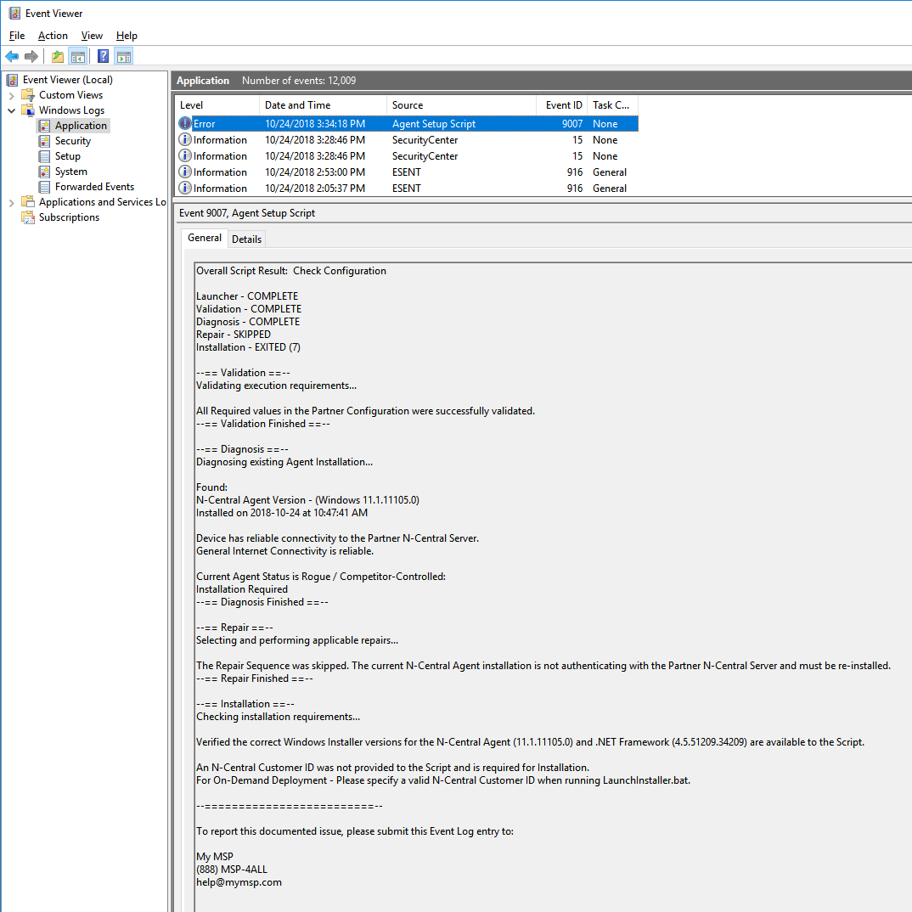

# InstallAgent Automation Suite

This is a community-based Automation Suite intended as a replacement for the stock N-central Group Policy Installer Script as provided by N-able. It is not supported by SolarWinds MSP or N-able, so please do not contact their support department regarding any problems or questions about this script. In addition, please do not contact the support departments of any individual Partners in the SolarWinds MSP Community regarding the Automation Suite or its components.

If you discover a problem with any component of the Automation Suite or have ideas on how it could be improved, post an issue on GitHub . Alternatively, post on the NRC discussion forum.

These tools are provided as-is, in the best of faith, by those Partners and Community Members involved in their development. If you use this in your environment, we would love to hear from you on GitHub!

# Key Features

The **InstallAgent Automation Suite** provides the following key features for deployment and facilitation of the N-Central Agent:

*   Automatic Installation of up to 2 distinct versions of the N-Central Agent per Domain environment, including:
    *   N-Central System-Level Agent 11.0.0.1114 (the latest Agent version that does not require .NET Framework 4.5.2, and therefore still compatible with Windows XP / Server 2003)

*   Automatic Installation of prerequisite software required by the **Agent Setup Script** and the N-Central Agent which, at time of publication, includes:
    *   N-Central Agent Requirements
        *   .NET Framework 4.5.2 for Current Agents (11.0.1.xxxx and Above)
        *   .NET Framework 4.0 for Legacy Agents (11.0.0.xxxx and Below)
    *   Script Requirements
        *   PowerShell 2.0 for XP / Server 2003 / Vista / Server 2008 (requires manual reboot after Installation)
        *   .NET Framework 2.0 SP1 for XP / Server 2003
        *   Service Packs for XP / Server 2003 / Vista / Server 2008 (requires manual reboot after Installation)

*   Boot-Time or On-Demand Detection and Automatic Repair of degraded or non-functional Agents with the following symptoms:
    *   Stopped Agent Service(s)/Process(es)
    *   Missing Agent Service(s)/Process(es)
    *   Incorrect Agent Service(s) Startup Type (Partner Configurable)
    *   Incorrect Agent Service Failure Behavior (Partner Configurable)
    *   Missing Agent Installation
    *   Invalid Appliance ID in Local Agent Configuration (causes Agent check-in to fail)
    *   Invalid N-Central Server in Local Agent Configuration (causes Agent check-in to fail)
    *   Rogue or Competitor Agent (reclaims Agents that may be authenticating with another N-Central Server)
    *   Outdated Agent Installations (Partner Configurable)

*   Verbose single-entry Event Log Output each run - Get a full report of any findings and actions without cluttering your Event Log

*   Live Script Status Updates and Timestamps for last actions the Script has taken via Registry

*   Highly Customizable for your environment - Configure different values for Legacy vs Current Agent installations, or for each Domain you deploy to

# Components

The **InstallAgent Automation Suite** is comprised of several Components to aid in the deployment and facilitation of the N-Central Agent, which are listed below:

## Deployment Package

The **Deployment Package** is suitable by itself for all deployments, and contains the following items:

*   **AGENT** Folder
    *   **CurrentAgent** Folder
        *   **NET4_5_2-Universal.exe** - .NET Framework Installer required by Current Agents (11.0.1.xxxx and Above)
    *   **LegacyAgent** Folder
        *   **NET4_0-Universal.exe** - .NET Framework Installer required by Legacy Agents (11.0.0.xxxx and Below)
        *   **WindowsAgentSetup.exe** - System-Level Agent Installer 11.0.0.1114 (latest Agent Installer compatible with Windows XP / Server 2003)
    *   **Lib** Folder
        *   **InstallAgent-Core.psm1** - Core Functions file for the **Agent Setup Script** (InstallAgent.ps1) which contains most of its key operations
    *   **PS2Install** Folder
        *   **XPTools** Folder - Windows Support Tools for Windows XP / Server 2003 (Allows for Command-Line File Download)
            *   **2003** Folder
                *   support.cab
                *   suptools.msi
            *   **XP** Folder
                *   sup_pro.cab
                *   sup_srv.cab
                *   support.cab
                *   suptools.msi
    *   **InstallAgent.ps1** - **Agent Setup Script,** the main/wrapper script, which contains most pre-defined constants and structures for execution
    *   **LaunchInstaller.bat** - **Agent Setup Launcher,** the launcher script, which is called On-Demand (click-to-run) or by Group Policy (calling the Launcher by either method **requires an N-Central Customer/Site ID number as a Parameter for any new Agent installations**)
    *   **PartnerConfig.xml** - **Partner Configuration,** which is used to dictate most variable options to the **Agent Setup Script**

## AMP-Based Custom Service Package

The **Custom Service Package** is an optional download available with the **Deployment Package,** which integrates with N-Central to collect and monitor information about the most recent run of the **Deployment Package.**

***ATTENTION - The Custom Service Package is no longer compatible with Deployment Package 5.0.0 and above***

The **Custom Service Package** contains the following items:

*   **CustomService** Folder - Not required for any other Packages
    *   **InstallAgent status.amp** - Automation Policy run by the Custom Service
    *   **InstallAgent status - Tim Wiser.amp** - Automation Policy run by the Custom Service, for **Deployment Packages** still using Tim's Registry key (4.01 and Below)
    *   **Agent Installer Script Status.xml** - Custom Service Configuration file

# Preparation

## 1 - Update the Partner Configuration

**The developers recommend editing the Partner Configuration (PartnerConfig.xml) with Visual Studio Code, however feel free to use your favorite text editor that supports "UTF-8 w/ BOM" Encoding.**

Open **PartnerConfig.xml** to begin. This **Partner Configuration** is your one-stop shop for configuring the **Deployment Package.** Enter data for each value between the relevant XML Tags (many values are already assigned Defaults to serve as an example). Information about the Expected Format and Purpose of each Configuration Value is contained above each value itself. Consider the table below a desk reference.

| Category | Value Name | Default Value | Mandatory | Purpose |
| -------- | ---------- | ------------- | --------- | ------- |
| **Branding** | *ErrorContactInfo* | | No | This is a space for your business contact info (Company Name, Address, Support Phone Number, etc.). This will be printed at the bottom of the Event Log entry when a documented error occurs. If using multiple lines, start your information at the **beginning of each line** (no indent) in the tag space. |
| **ScriptBehavior** | *BootTimeWaitPeriod* | 5 | No | If the system has booted recently, this is the amount of time (in minutes) to wait before Diagnosing an existing Agent (to avoid unnecessary Repair or Install due to the system still starting up) |
| | *InstallTimeoutPeriod* | 5 | Yes | If another program installation is already in progress on the system, this is the amount of time (in minutes) to wait for the Windows Installer Service to become available. If the Service is still busy when the *InstallTimeoutPeriod* expires, the **Agent Setup Script will terminate for this reason.** |
| **ServiceBehavior** | *ActionA* | RESTART | No | Windows Service Failure Actions for the Agent Services - What Windows will do when the Service fails |
| | *ActionB* | RESTART | No | You must specify actions consecutively, for example, if *ActionC* is specified, then neither *ActionA* nor *ActionB* can be empty. |
| | *ActionC* | RESTART | No | |
| | *DelayA* | RESTART | No | Windows Service Failure Delays (in seconds) for the Agent Services - How long Windows will wait before taking each Action |
| | *DelayB* | RESTART | No | You must specify delays consecutively, for example, if *DelayC* is specified, then neither *DelayA* nor *DelayB* can be empty. |
| | *DelayC* | RESTART | No | Each Action should have a corresponding Delay, but if an Action is left blank, **the corresponding Delay value will be ignored.** |
| | *Command* |  | No | Command to execute for each **RUN** Action specified. **Use the absolute path to the Command to ensure your Command will run when and how you expect.** |
| | *Reset* | 1440 | No | Windows Service Failure Reset Period (in minutes) for the Agent Services - How long until Windows re-attempts the Failure Actions |
| | *Startup* | Auto | Yes | Desired Startup Type for the Agent Services |
| **Server** | *NCServerAddress* | | Yes | Your N-Central Server Address, which can be found in the **Server Address** box on the **Administration > Defaults > Appliance Settings > Communication Settings** page. **Do not copy and paste a Web Address.** For example, if you login to **https://n-central.mymsp.com/MyServiceOrganization/**, the Server Address may be **n-central.mymsp.com** instead. **You will always get the correct value from N-Central itself.** |
| | *PingTolerance* | 20 | Yes | Percentage value of dropped packets allowed when testing connectivity to the *NCServerAddress* specified |
| | *PingCount* | 10 | Yes | The number of pings performed when testing connectivity to the *NCServerAddress* specified |
| | *ProxyString* | | No | Proxy String if the Agent requires one to reach the *NCServerAddress* specified - see the **Partner Configuration** file for Acceptable Formats |
| **Deployment** | *LocalFolder* | C:\AGENT | Yes | This is the path of a Folder left behind on the system for retaining Local Activation Info for the Agent from previous runs of the **Deployment Package.** It contains no more information than is already in the Agent installation folder, but is there **in case the Agent is removed by a user, technician or N-Central Update and not installed again afterward.** |
| | *NetworkFolder* | AGENT | Yes | Name of the Root Folder that contains the **Deployment Package.** In Domain Group Policy Deployments, this must be placed in the NETLOGON Folder. **NOTE - Partners CURRENTLY using Versions of the InstallAgent Deployment Package PRIOR to 5.0.0 should NOT change this value from its Default (AGENT) unless they wish to update all existing GPOs with the new location** |
| **Deployment (Typical)** | *InstallFolder* | CurrentAgent | Yes | Name of the Folder used by the Package to hold relevant Installers for Current Agents (11.0.1.xxxx and Above) |
| | *NETFileName* | NET4_5_2-Universal.exe | Yes | Name of the .NET Framework Installer supplied in the Typical *InstallFolder* - change this only you elect to use a different package (i.e. .NET 4.6 for Vista/2008) |
| | *NETVersion* | 4.5.2 | Yes | User-Friendly Version of .NET Framework to install on Typical systems - for verification/logging purposes |
| | *NETFileVersion* | 4.5.51209.34209 | Yes | Windows Version of the .NET Framework Installer to use on Typical systems, which should match the **File Version** property when you right-click **Properties > Details.** |
| | *SOAgentFileName* | WindowsAgentSetup.exe | Yes | Name of the Agent Installer supplied in the Typical *InstallFolder* - change this each time you upgrade your N-Central Server, and **be sure to use the System-Level Agent Installer** |
| | *SOAgentVersion* | 12.0.1.118 | Yes | User-Friendly (N-Central) Version of the Agent to install on Typical systems - for verification/logging purposes |
| | *SOAgentFileVersion* | 12.0.10118.0 | Yes | Windows Version of the Agent Installer to use on Typical systems, which should match the **File Version** property when you right-click **Properties > Details.** |
| **Deployment (Legacy)** | *InstallFolder* | LegacyAgent | Yes | Name of the Folder used by the Package to hold relevant Installers for Legacy Agents (11.0.0.xxxx and Below) |
| | *NETFileName* | NET4_0-Universal.exe | Yes | Name of the .NET Framework Installer supplied in the Legacy *InstallFolder* - The supplied Installer is the only version suitable for Windows XP / Server 2003 and the N-Central Agent (since .NET 4.0 is a minimum requirement of the Agent, and maximum version for XP / 2003) |
| | *NETVersion* | 4.0 | Yes | User-Friendly Version of .NET Framework to install on Legacy systems - for verification/logging purposes |
| | *NETFileVersion* | 4.0.30319.1 | Yes | Windows Version of the .NET Framework Installer to use on Typical systems, which should match the **File Version** property when you right-click **Properties > Details.** |
| | *SOAgentFileName* | WindowsAgentSetup.exe | Yes | Name of the Agent Installer supplied in the Typical *InstallFolder* - The supplied Installer is the latest version suitable for Windows XP / Server 2003 - only change this if you elect to use an earlier version of the Installer |
| | *SOAgentVersion* | 11.0.0.1114 | Yes | User-Friendly (N-Central) Version of the Agent to install on Typical systems - for verification/logging purposes |
| | *SOAgentFileVersion* | 11.0.2114.0 | Yes | Windows Version of the Agent Installer to use on Typical systems, which should match the **File Version** property when you right-click **Properties > Details.** |

Once you've made your adjustments, in most cases, you should be able to utilize the Configuration Values for your all your clients, but you may elect to customize them for specific environments. For example, you may wish to increase the *PingTolerance* for a Customer/Site where you know there is significant latency, and therefore Agents may have trouble reliably communicating with the N-Central Server.

A small amount of customization can also be made in the **Agent Launcher Script** (LaunchInstaller.bat):

| Value Name | Default Value | Mandatory | Purpose |
| ---------- | ------------- | --------- | ------- |
| *TempFolder* | C:\Windows\Temp\AGPO | Yes | This should be a Local Folder on the system where the **Deployment Package** components work from, **NOT to be confused with the *LocalFolder* value in the Partner Configuration.** Whether run by Group Policy or On-Demand (click-to-run), the required components are dropped here during execution and then **removed upon termination of the Package.** |
| *DLThreshold* | 3 | Yes | This is the maximum number of attempts the **Agent Setup Launcher** will make to download any prerequisite components needed for Agent installation. If this value is exceeded, the **Launcher will terminate, and it must be run again.** |

If you elect to make any changes, you will need to adjust the values **immediately following the equals (=) sign** in their relevant **SET** statements. For example:

SET DLThreshold=**3**

becomes

SET DLThreshold=**5**

You may make a similar change to the one above in environments where network latency or reliable Internet connectivity is an issue.

## 2 - Configure N-Central for Automatic Device Import

In N-Central, Devices are **not automatically imported into the All Devices View by default.** To better facilitate the **InstallAgent Deployment Package** (especially GPO Deployments), enable Auto-Import of Windows Devices for the Customers/Sites you have deployed to by doing the following:

1 -  In N-central, open the Service Organization, Customer, or Site Level (whichever is most appropriate for where you will use the **Deployment Package**)

2 -  Open **Administration > Discovery Defaults** from the sidebar

3 -  Ensure that the **Workstations – Windows, Laptops – Windows** and **Servers – Windows** Device Classes have been added to the Selected box in the Auto-Import section (see below)

4 -  Click **Save**

## 3 - Setup a Deployment Package

1 -  In N-Central, from any Level, open **Actions > Download Agent/Probe Software** from the sidebar

2 -  Download your Agent Installer from the **System Software** section at the very bottom of the page. **Do NOT use a Customer or Site-specific Agent with the Deployment Package, or Installation actions may fail, resulting in missing Agents.**

3 -  Verify the following values for the System-Level Agent Installer you downloaded are correct in the Partner Configuration:

*   *(Typical)SOAgentFileName*
*   *(Typical)SOAgentVersion*
*   *(Typical)SOAgentFileVersion*

4 -  Add the System-Level Agent Installer to the ***NetworkFolder*\**(Typical)InstallFolder*** location

5 -  If you choose to use a different Legacy Agent, perform steps 4 and 5 for the *(Legacy)* variety of each value in the **Partner Configuration,** and replace the existing Agent Installer in the ***NetworkFolder*\**(Legacy)InstallFolder*** location

The **Deployment Package** is now ready for On-Demand or Group Policy deployments!

# Deployment

You may utilize a single instance of the **InstallAgent Deployment Package,** such as the one you created in Step 3, for both Group Policy and On-Demand (click-to-run) deployment scenarios. **Please test the Deployment Package in your own controlled environment before starting a wide-scale deployment. Every environment is different!**

## 1 - Choose a Deployment Method

### On-Demand Deployment

This method is suitable for one-off Devices, or those that do not belong to a Windows Domain. The most common scenario for On-Demand Deployment is likely **installing on a single system that is completely new to the N-Central Agent.**

1 -  Grant access to the **Deployment Package** on the system (attach a removable USB drive, download or transfer the Package, etc.)

2 -  With a Local Administrator account, open a Command Prompt and run **LaunchInstaller.bat** with the desired Customer/Site ID as the **only Parameter**

Example - **DO NOT USE**

F:\DeploymentStuff\AGENT\LaunchInstaller.bat 170

Another use case for On-Demand Deployment may be running the **Deployment Package** for **Repair or Re-Installation purposes.**

1 -  Grant access to the **Deployment Package** on the system (attach a removable USB drive, download or transfer the Package, etc.)

2 -  With a Local Administrator account, simply double-click **LaunchInstaller.bat.** A Customer/Site ID Parameter will typically not be needed **UNLESS:**

*   There is no Agent on the system **AND**
*   There is no Local Activation Info from previous runs of the **Deployment Package**

If you're looking at targeting multiple systems with the **Deployment Package,** the most common solution is to set it up as a Group Policy Startup Script (see the **Group Policy Deployment** section below).

### Group Policy Deployment

This is by far, the preferred method for enterprise, or Windows Domain-managed environments of any size. This will allow the **Deployment Package** to run from the network on **any Domain system that has contact with a Domain Controller at boot.**

1 -  On a Domain Controller (preferably the Baseline Domain Controller), open the NETLOGON Folder (typically **\\clientdomain.name\NETLOGON**) and place the entire **Deployment Package** (*NetworkFolder*) here

**NOTE - Partners CURRENTLY using Versions of the InstallAgent Deployment Package PRIOR to 5.0.0**
*   Simply replace the **AGENT** Folder in its entirety with the *NetworkFolder* you've defined in the **Partner Configuration**
*   You will NOT need to revise your existing GPO Parameters at all in the following steps, **UNLESS you have elected to change the *NetworkFolder* from its Default Value (AGENT)**

2 -  In the **Group Policy Management Console,** create a new **Group Policy Object** and link to a suitable OU or to the Domain itself. You might name it **InstallAgent Deployment Package,** **Agent Deployment** or similar.

3 -  Select the new Group Policy Object node in the left-hand pane, then under the **Scope** tab and **Security Filtering** section, make sure **Authenticated Users** and **Domain Computers** are listed. If you would prefer not to deploy to **every Device in the Domain,** either exclude specific Computers from the GPO (remove Read Permissions) or use a separate OU from **Domain Computers.**

4 -  **Right-click and Edit** the new GPO node, then expand the following nodes in the left-hand pane: **Computer Configuration > Policies > Windows Settings > Scripts.** Open the **Startup** item on the right.

5 -  Click the **Add** button, and for the Script Name box, **Browse** to **\\clientdomain.name\NETLOGON\**NetworkFolder*** and select **LaunchInstaller.bat.**

6 -  In N-Central, locate the Customer/Site ID for the client's Domain by reviewing either the **Administration > Customers** page at the Service Organization Level, or the **Administration > Sites** page at the Customer Level. Consider your environment before selecting the ID. In most scenarios, **you will probably want the Customer-Level ID,** since most Customers have a single Domain, or you may simply not use the Site Level in your N-Central setup. If, however, you have a **Domain or OU that is specific to only one Site,** you may opt to use that specific Site ID to have new Devices import there directly, instead of at the Customer Level.

7 -  In the **Script Parameters** box, type the 3-digit Customer/Site ID that you have selected for that client's Domain. Your entries should look similar to the screenshot below (client Domain name blocked out for privacy):

Congratulations! Your **Group Policy Deployment** is ready for action!

## OPTIONAL
## 1a - Setup the N-Central Custom Service (Version 4.xx)

***ATTENTION - The Custom Service Package is no longer compatible with Deployment Package 5.0.0 and above***

Another option for viewing results of the **Deployment Package** is to **Monitor the Registry updates it makes to the Device with N-Central.** You can setup the **Custom Service Package** to do exactly that! The current Version of the **Custom Service** is called **Agent Installer Script Status** in N-Central, and is compatible with the following:

*   **InstallAgent Deployment Package 4.xx**
*   **N-Central 9.5 SP1 and Above**

For setup and configuration help, consult the appropriate SolarWinds MSP N-Central Documentation for **Importing a Custom Service.**

## 2 - Review Deployment Package Results

### Windows Event Log

The **InstallAgent Deployment Package** creates a detailed report in the **Windows Application Event Log** of its findings and any actions taken **each time it exits,** utilizing the following Event Sources:

*   **Agent Setup Launcher** - For any events prior to execution of the **Agent Setup Script** (this is primarily prerequisite Software Installation for the Agent)
*   **Agent Setup Script** - For most events during execution of the **Deployment Package** (this Event Source will be your go-to for details on what happened and why)

Below is a sample of the output written to the Event Log after running the **Deployment Package** in On-Demand (click-to-run) Mode:

Because the **Agent Setup Script** determined that a re-install was needed, and a Customer/Site ID was not supplied to the **Agent Setup Launcher,** it terminated prematurely before fixing this **severely-damaged, but still-present Agent installation.** From here, we can tell what the problem is and what is needed to resolve the problem - a Customer/Site ID must be supplied to the Agent Setup Launcher (whether at command-line or via GPO), so the Agent can be re-installed.

To get a better idea of exactly how damaged this installation is, we can supplement our report with values the **Agent Setup Script** logged to the Windows Registry.

### Windows Registry

Values are logged and regularly updated by the **Deployment Package** during execution, at the following keys and their children:

*   **HKLM:\SOFTWARE\SolarWinds MSP Community\LaunchInstaller** - For values logged by the **Agent Setup Launcher**
*   **HKLM:\SOFTWARE\SolarWinds MSP Community\InstallAgent** - For values logged by the **Agent Setup Script**

Therefore, you can poll this data at any time and get a sense of what the **Deployment Package** is doing or has done **both during and after execution.** The next section details the Registry Keys and Values that appear here.

#### InstallAgent Key

Execution/Summary values of the **Agent Setup Script** are stored here and may include the following:

*   *AgentLastDiagnosed* - The time the DIAGNOSIS Sequence last completed (when the Agent was last checked out, or found to be missing)
*   *AgentLastInstalled* - The time the INSTALLATION Sequence last completed (when an Installation action was last attempted or performed)
*   *AgentLastRepaired* - The time the REPAIR Sequence last completed (when a Repair action was last attempted or performed)
*   *ScriptAction* - The last action being performed by the most recent run (what it is currently doing, or was doing on exit)
*   *ScriptExitCode* - The Exit Code returned by the most recent run (see the **Testing and Troubleshooting** section below for more information)
*   *ScriptLastRan* - The time the most recent run **began**
*   *ScriptMode* - The Deployment Mode established the Script during most recent run (it tells this based on where it is executed from)
*   *ScriptResult* - The Reason matching the Exit Code returned by the most recent run (see the **Testing and Troubleshooting** section below for more information)
*   *ScriptSequence* - The last Sequence being executed by the most recent run
*   *ScriptVersion* - The Script Version of the most recent run (see the included **Changelog.md** for more information)

**Agent** values in this key **will persist until the next time they are updated.** For example, a previous run executed a Repair, but the next time the **Agent Setup Script** runs, a Repair is not needed, therefore **the Repair time from the previous run remains for historical purposes.**

**Script** values in this key **are updated EVERY instance of the Agent Setup Script,** and so are always indicative of the latest run.

In our example scenario, we can quickly see the *ScriptAction* and *ScriptResult* values match the report written to the Event Log. We can also see that the **Agent was successfully installed earlier the same day by the Agent Setup Script** before it was at some point summarily beheaded and reduced to a mindless zombie.

#### Diagnosis Key

Values related to the **Diagnosis Sequence** of the **Agent Setup Script** are stored here and include the following:

*   *AgentStatus* - The Overall Health of the Agent when the Sequence last completed (Optimal is well... optimal!)
*   *ApplianceIDValid* - Whether the Agent Appliance ID exists and has a valid format
*   *AssignedToPartnerServer* - Whether the Agent is assigned to the *NCServerAddress* specified in the **Partner Configuration**
*   *Installed* - Whether the Agent is installed
*   *ProcessesExist* - Whether the Service-related Processes for the Agent exist in their prescribed locations
*   *ProcessesRunning* - Whether the Service-related Processes for the Agent are running
*   *ServicesBehaviorCorrect* - Whether the Agent Service Failure Behavior matches the **Partner Configuration**
*   *ServicesExist* - Whether the Agent Services are present and registered on the system
*   *ServicesRunning* - Whether the Agent Services are running
*   *ServicesStartupCorrect* - Whether the Agent Service Startup Types match the **Partner Configuration**
*   *VersionCorrect* - Whether the Agent version installed matches the **Partner Configuration**

In our example scenario, we can see that the Agent is **Rogue or Competitor-Controlled** because it is **not authenticating with the Partner-defined N-Central Server** (in fact, the Local Configuration file, which tells the Agent where to phone home to, has been deleted!). This situation demands a re-install, since there is insufficient Activation Info from the current installation (the Local Configuration file is gone), and there is no historical Activation Info (published during a previous successful installation by the **Agent Setup Script** - this was deleted too!) to repair the Local Configuration, so **it is as if the Script was running on a new machine without any previous info at all.**

#### Installation Key

Values related to the **Installation Sequence** of the **Agent Setup Script** are stored here and include the following:

*   *InstallExitCode* - The Exit Code returned by MSIEXEC from the last Installer ran by the Script (0 is the best news, like most exit codes)
*   *Method* - The last Install Method selected by the Script (there are several, and these vary with how the Agent was last activated)
*   *MethodAttempts* - The number of attempts made by the last Install Method
*   *MethodSuccessful* - Whether the last Install Method succeeded
*   *SelectedAgentKit* - The **Deployment Package** chosen by the Script for the required Agent Installer
*   *SelectedNETKit* - The **Deployment Package** chosen by the Script for the required .NET Framework Installer
*   *VerifiedServices* - Whether the Agent Service Configuration was successfully enforced post-install (settings in the **Partner Configuration** likely differ from those set during installation)
*   *VerifiedStatus* - Whether the Agent Health post-install was found to be Optimal

Following up on our example, the **Agent Setup Launcher** was later called with an appropriate Customer ID Parameter, **which was then selected as the Installation *Method.*** We can see that the Agent and .NET Framework Installers used were directly from the On-Demand **Deployment Package.** In a Group Policy Deployment, the Network **Deployment Package** will typically be used, but if any required Installers are not found in one place, the other will be searched. Activation by the Customer ID *Method* was successful, so this ID was recorded in a History file in the *LocalFolder* specified in the **Partner Configuration** for later use. The Agent Service Configuration was verified successfully, and the Agent was shown to be in Optimal Health post-install.

#### Repair Key

Values related to the **Repair Sequence** of the **Agent Setup Script** are stored here and include **the various Repairs that were attempted** by the most recent run and **whether they succeeded.** Possible Repairs at this time include:

*   *Orphaned Appliance* - A Repair ran **in most instances where the Local Agent Configuration is present, but incorrect.** Occasionally, an Agent will receive a **-1** for an Appliance ID, or **localhost** as a configured N-Central Server, both of which would cause it to stop checking in with your N-Central Server. This Repair **will restart the Agent Services after correcting the Local Configuration** to restore proper functionality. This Repair also resolves tampering with the Appliance ID.
*   *Incorrect Service Startup Type* - A Repair ran **when the Startup Type of one or more Agent Services is incorrect.** This Repair is configuration-based and does not require any further action.
*   *Incorrect Service Behavior* - A Repair ran **when the Windows Service Failure Behavior of one or more Agent Services is incorrect.** This Repair is configuration-based and does not require any further action.
*   *Process/Service Not Running* - A Repair ran **when one or more Agent Services or Processes are not running on the system.** Some software Services are known to run in a "zombie" state, where the Service is running, but the associated Process is not. In such a case, **the Agent Services will be restarted to correct the issue.** This Repair eliminates any possibility where this scenario might happen and keeps the Agent up and running in general.
*   *Insufficient History Data* - A Repair ran **when the Local Activation Info file contains insufficient data to install the Agent** in the event it is fully removed. This Repair also resolves tampering with the Local Activation Info file.

Lastly in our example, the Agent Service Configuration has been compromised once again since successful re-install, and so another run of the **Deployment Package** is due. This time the Agent is found to be intact, but disabled, **since one or more Services are not running or misconfigured.** The **Agent Setup Script** resolved both issues via Repair, however, and the RMM world is safe again for another day.

### N-Central Custom Service

***ATTENTION - The Custom Service Package is no longer compatible with Deployment Package 5.0.0 and above***

If you have setup the **Custom Service Package,** you can also review the results of the most recent run of the **Deployment Package** directly in N-Central!

A sample of output from the **Custom Service** in N-Central can be seen below:

| Parameter | Thresholds | Description |
| --------- | ---------- | ----------- |
| *Date/Time of Last Execution* | None | Timestamp of most recent **Agent Setup Script** run |
| *Path to Installer Files* | None | Location of the *NetworkFolder* |
| *Script Version* | Warning on Outdated Version | Detected Version of the **Agent Setup Script** |
| *Last Successful Completion* | None | Timestamp of last Successful result (Code 10) |
| *Last Result Code* | Warning on Codes 1 thru 9, Failed on Code 0 | Exit Code returned by the most recent **Agent Setup Script** run |
| *Last Execution Mode* | Warning on Interactive Mode | Execution Mode used by the most recent **Agent Setup Script** run |

# Testing and Troubleshooting

Execution of the **InstallAgent Deployment Package** is fully automatic, to facilitate hands-off or scripted deployment. Therefore, you may test it by any way and from any location you choose. Regardless of how you call the Package and what happens as a result, the **Event Log and Registry Key will tell you what actions were performed, what (if anything) is still needed, and how to resolve any errors the Package may encounter.**

That said, due to the complexity of the **Deployment Package,** there are several different Exit Codes and scenarios you may encounter, which are detailed in the tables below.

### Agent Setup Launcher Exit Codes

| Exit Code | Event ID | Description | Resolution |
| --------- | -------- | ----------- | ---------- |
| 10 | 10 | Successful Execution | None - All prerequisite Software is installed and the **Agent Setup Script** was launched successfully |
| 11 | 11 | Execution Failed | General Failure - The Event Log will contain the details on the failure and resolution. |
| 12 | 12 | Reboot Required | The system requires a manual reboot for prerequisite Software installation. Run the Launcher again post-boot to continue setup. |
| 13 | 13 | OS Not Compatible | The Windows Operating System is not compatible with any Legacy or Current Agents (Windows 2000/ME and older). This **may** also occur on brand new Windows Releases, if Microsoft changes its build scheme again, as it did with Windows 10. |

### Agent Setup Script Exit Codes

| Category | Exit Code | Event ID | Description | Resolution |
| -------- | --------- | -------- | ----------- | ---------- |
| **Standard Execution Codes** | 0 | 9000 | Graceful Exit | None - All functions of the **Agent Setup Script** completed successfully |
| | 1 | 9001 | Partner Configuration File is Missing | Verify the correct name, location and format of the **Partner Configuration** file in the **Deployment Package.** If necessary, re-download, configure and replace the file. |
| | 2 | 9002 | Partner Configuration is Invalid | Check the **Partner Configuration** and corresponding items in the **Deployment Package** to make sure they match |
| | 3 | 9003 | No Installation Sources Available | Check the *InstallFolder* values in the **Partner Configuration** and match with those in the **Deployment Package.** The On-Demand *InstallFolder* should ALWAYS be available, at minimum, each run. |
| | 4 | 9004 | Installer File is Missing | Verify the appropriate Installer-based values in the **Partner Configuration** are correct (particularly the name), and ensure the Installer requested is present in the appropriate *InstallFolder* |
| | 5 | 9005 | Installer Version Mismatch | Verify the appropriate Installer-based values in the **Partner Configuration** are correct (particularly the versions), and ensure the Installer version requested is present in the appropriate *InstallFolder* |
| | 6 | 9006 | Unable to Reach Partner N-Central Server | Run the Package again via the Launcher (this issue is usually caused by transient network slowness or loss of connectivity during execution). If this issue persists, consider checking the *NCServerAddress* value in the **Partner Configuration** for accuracy. |
| | 7 | 9007 | Customer ID Parameter Required | Provide a valid N-Central Customer/Site ID to the Launcher to resolve an Installation issue with the Agent |
| | 8 | 9008 | Customer ID Parameter Invalid | Verify the Customer/Site ID provided to the Launcher is valid |
| | 9 | 9009 | Windows Installer Service Unavailable | Run the Package again via the Launcher (this issue is usually transient due to another program install taking place). If the issue persists, review and complete or terminate any pending installations on the system before trying again. |
| | 10 | 9010 | .NET Framework Installation Failed | The .NET Framework Version was not found to be upgraded after installation. Check for any Event Log entries from **.NET Framework** or **MSIInstaller** for details. |
| | 11 | 9011 | Agent Removal Failed | The existing Agent was not found to be removed after installation. Check for any Event Log entries from **Windows Agent Installer** or **MSIInstaller** for details. |
| | 12 | 9012 | No Installation Methods Remaining | All Installation Method attempts have failed. Check for any Event Log entries from **Windows Agent Installer** or **MSIInstaller** for details. |
| **Internal Execution Codes** | 100 | 9100 | Invalid Parameter | A Core Function was supplied an invalid Parameter. Please submit an Issue to GitHub as described below. |
| | 101 | 9101 | No Repairs Selected | The Script determined that Repairs were required but no Repairs were selected to apply. Please submit an Issue to GitHub as described below. |
| | 102 | 9102 | File Transfer Failed | One or more required Files were not found after transfer. Please submit an Issue to GitHub as described below. |
| | 103 | 9103 | File Not Found | A required File was not found at the location specified. Please submit an Issue to GitHub as described below. |
| | 104 | 9104 | File/Folder Creation Failed | The Script was unable to create a required File/Folder. Please submit an Issue to GitHub as described below. |

**Internal Execution Codes** should not be encountered during any routine run of the **Agent Setup Script.** If you encounter such an issue, please submit the following items in an Issue to GitHub at :

*   **Agent Setup Script** Event Log Entry
*   **InstallAgent** Registry Key
*   Windows OS Edition, Release and Build Number (i.e. Windows 10 Enterprise - 10.0.17134.112)
*   Windows PowerShell Version (from $PSVersionTable)

**Standard Execution Codes** are returned each run and anything other than Success usually indicates some sort of action is needed with the **Deployment Package** or systems involved to resolve an issue. If you elect to store your business contact information in the *ErrorContactInfo* value in the **Partner Configuration,** any run with a non-Successful **Standard Execution Code** will display this information at the bottom of the Event Log entry.

# Excluding Devices

It’s not always desirable to deploy the Agent to every single Domain Computer. For example, you may have Windows Devices that control PLCs for manufacturing or production, POS/Retail systems that run Windows Embedded, or other Devices that otherwise do not make sense to manage or remote control.

The best way to do this is:

1 -   Create an OU in Active Directory containing the Computers you do not wish to deploy to
2 -   Set a **Deny Permission** for this OU in the ACL of the **Deployment Package** GPO

# Routine Updates

When you upgrade your N-central Server, you will need to update all your **Deployment Packages** in two ways:

1 -   Update the *(Typical)SOAgentVersion* and *(Typical)SOAgentFileVersion* values in the **Partner Configuration** file so the Package will require the new Agent be installed
2 -   Replace the existing System-Level Agent Installer in the *(Typical)InstallFolder* with one downloaded from your newly-upgraded N-Central Server (Actions > Download Agent/Probe Software > System Software)

**Don't forget to make sure the *(Typical)SOAgentFileName* matches,** in case SolarWinds MSP ever decides to change the default name of the file!

TIP - There are several partners on the SolarWinds MSP discussion forum who have implemented Automation Policies or Scripts that are designed to ease this task, so we strongly recommend that you grab the most suitable one for your needs.

# Credits

Special Thanks go to the following Partners and Community Members for their contributions to the **InstallAgent Automation Suite:**

*   Pat Albert of N-Able Technologies, for creation and development of the AGENTCLEANUP4.EXE utility, implemented in earlier Versions of the Deployment Package
*   Tim Wiser of GCI Managed IT
    *   **Deployment Package** VBScript (InstallAgent.vbs) Version - Initial Release and Development of Majority Updates
*   Jon Czerwinksi of Cohn Consulting Corporation
    *   **Deployment Package** VBScript (InstallAgent.vbs) Version - Optimization, Unified Configuration and Development of Ongoing Updates
*   Ryan Crowther Jr of RADCOMP Technologies
    *   **Deployment Package** PowerShell (InstallAgent.ps1) Version - Initial Release

*   All Partners and SolarWinds MSP Community Members who have helped and contributed ideas to this **Automation Suite**

